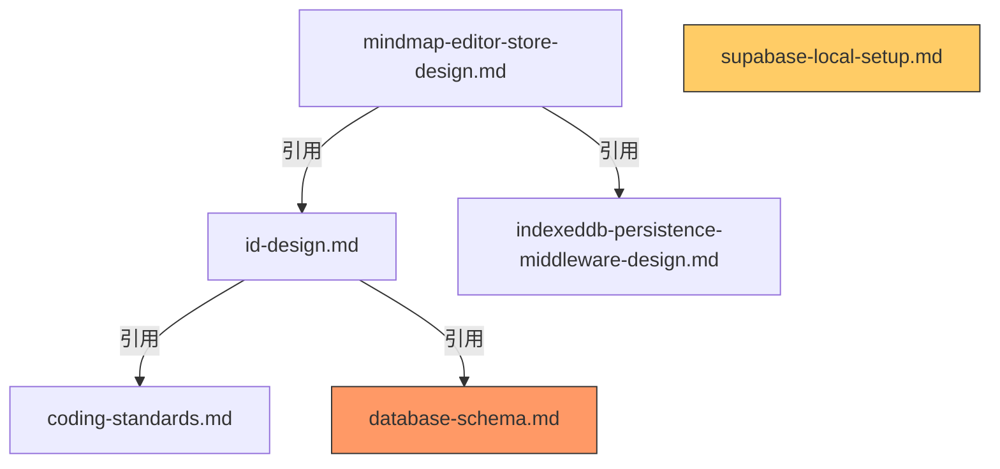

# doc-refactor-structure

分析整个文档体系的结构，识别组织和架构层面的改进机会。

## 用法

### 用法 1: 分析所有文档（默认）

```bash
/doc-refactor-structure
```

- 分析 `docs/design/` 和 `docs/standard/` 下的所有文档
- 生成完整的文档体系分析报告

### 用法 2: 分析指定目录

```bash
/doc-refactor-structure docs/design/
```

- 仅分析指定目录下的文档
- 适用于局部优化

---

## 功能说明

从宏观角度分析整个文档体系，识别以下问题：

1. **文档组织结构**: 文档分类是否合理、目录结构是否清晰
2. **文档间关系**: 引用关系、依赖关系、重复内容
3. **文档完整性**: 缺失的关键文档、覆盖盲区
4. **命名一致性**: 文件命名、术语使用、分类标准
5. **可发现性**: 索引、导航、入口文档

## 执行步骤

### 步骤 1: 扫描文档体系

遍历指定目录，收集所有 `.md` 文件的元信息：

- 文件路径和名称
- 文档标题
- 元信息（作者、创建日期、相关文档）
- 文档大小和章节数
- 最后修改时间

### 步骤 2: 多维度分析

#### 维度 A: 文档分类和组织

**分析内容**:

- 当前目录结构是否合理
- 文档是否按功能、类型、阶段正确分类
- 是否存在分类模糊或交叉的文档

**识别问题**:

- 🔴 分类错误：文档放在了错误的目录
- 🟡 分类模糊：文档属于多个分类，不知道放哪里
- 🟢 优化建议：可以更细化或合并某些分类

**示例发现**:

```markdown
### 🟡 分类模糊

- `development-setup.md` 位于 `docs/design/`
- **问题**: 这是环境配置文档，不是设计文档
- **建议**: 移动到 `docs/standard/` 或新建 `docs/setup/`
```

---

#### 维度 B: 文档间引用关系

**分析内容**:

- 解析所有文档中的链接和引用
- 构建文档依赖图
- 识别孤立文档（没有被引用的文档）
- 识别循环引用

**识别问题**:

- 🔴 断链：引用的文档不存在或路径错误
- 🟡 孤立文档：重要文档没有被任何其他文档引用
- 🟡 循环引用：A 引用 B，B 引用 A，可能导致理解困难
- 🟢 缺少索引：没有入口文档汇总所有设计文档

**示例发现**:

```markdown
### 🔴 断链

- `id-design.md` 引用 `database-schema.md`
- **问题**: `database-schema.md` 不存在
- **建议**: 创建该文档或移除引用

### 🟡 孤立文档

- `supabase-local-setup.md` 没有被任何文档引用
- **问题**: 新成员可能发现不了这个重要的环境配置文档
- **建议**: 在 `development-setup.md` 或 README 中添加引用
```

---

#### 维度 C: 文档完整性和覆盖

**分析内容**:

- 对比项目需求，识别缺失的关键文档
- 检查是否有文档覆盖盲区
- 评估文档的详细程度

**识别问题**:

- 🔴 缺失关键文档：核心功能或架构没有文档
- 🟡 文档过于简略：重要主题只有寥寥数语
- 🟢 建议补充：可以添加但非必需的文档

**常见缺失文档类型**:

- 架构概览文档（Architecture Overview）
- API 文档索引（API Reference）
- 数据模型总览（Data Model Overview）
- 测试策略文档（Testing Strategy）
- 部署文档（Deployment Guide）
- 故障排查文档（Troubleshooting）

**示例发现**:

```markdown
### 🔴 缺失关键文档

- **缺失**: `architecture-overview.md`
- **影响**: 新成员难以快速理解系统整体架构
- **建议**: 创建架构概览文档，包含系统分层、核心模块、数据流图

### 🟡 文档过于简略

- `supabase-local-setup.md` 仅 50 行
- **问题**: 缺少常见问题排查、配置详解
- **建议**: 补充详细的配置说明和故障排查章节
```

---

#### 维度 D: 命名和术语一致性

**分析内容**:

- 文件命名规范是否统一
- 文档内术语使用是否一致
- 分类命名是否清晰

**识别问题**:

- 🔴 命名冲突：不同文档使用相同或相似的名称
- 🟡 命名不规范：没有遵循约定的命名模式
- 🟢 术语不统一：同一概念在不同文档中使用不同术语

**命名规范检查**:

- 是否使用小写字母 + 连字符（kebab-case）
- 是否有清晰的命名模式（如 `<功能名>-design.md`）
- 是否避免了缩写和不明确的名称

**示例发现**:

```markdown
### 🟡 命名不规范

- `supabase-local-setup.md` vs `development-setup.md`
- **问题**: 一个用 "setup"，一个也用 "setup"，但含义不同
- **建议**: 重命名为 `supabase-environment.md` 和 `development-environment.md`

### 🟢 术语不统一

- `mindmap-editor-store-design.md` 使用 "mind map"
- `id-design.md` 使用 "mindmap"
- **建议**: 统一为 "mindmap"（一个单词）
```

---

#### 维度 E: 可发现性和导航

**分析内容**:

- 是否有清晰的入口文档（如 README、INDEX）
- 是否有文档索引或目录
- 新成员如何找到需要的文档

**识别问题**:

- 🔴 缺少入口文档：没有 README 或索引
- 🟡 导航不清晰：文档间跳转困难
- 🟢 可以改进：添加标签、分类索引

**示例发现**:

```markdown
### 🔴 缺少入口文档

- `docs/` 目录下没有 `README.md` 或 `INDEX.md`
- **影响**: 新成员不知道从哪里开始阅读文档
- **建议**: 创建 `docs/README.md`，包含：
  - 文档体系说明
  - 推荐阅读顺序
  - 各目录的用途
  - 快速查找指南

### 🟡 导航不清晰

- 设计文档之间缺少"相关文档"链接
- **建议**: 在每个文档的元信息中添加"相关文档"章节
```

---

### 步骤 3: 生成文档结构图

使用树状图或图表展示当前文档体系：

```
docs/
├── README.md (缺失 🔴)
├── design/
│   ├── INDEX.md (缺失 🟢)
│   ├── id-design.md ✅
│   ├── mindmap-editor-store-design.md ✅
│   ├── indexeddb-persistence-middleware-design.md ✅
│   ├── development-setup.md ⚠️ (分类不当)
│   ├── supabase-local-setup.md ⚠️ (分类不当)
│   └── draft/
│       └── mindmap-persistence-requirements.md ✅
└── standard/
    ├── coding-standards.md ✅
    └── project-structure.md ✅
```

**图例**:

- ✅ 位置正确
- ⚠️ 需要调整
- 🔴 严重缺失
- 🟢 建议添加

---

### 步骤 4: 生成引用关系图

使用 Mermaid 图表展示文档间引用关系：



**图例**:

- 红色节点：引用的文档不存在（断链）
- 橙色节点：孤立文档（没有被引用）

---

### 步骤 5: 生成结构分析报告

报告保存到 `.claude/logs/refactor-reports/YYYY-MM-DD-structure-analysis.md`

## 报告格式

````markdown
# 文档体系结构分析报告

**生成时间**: YYYY-MM-DD HH:mm:ss
**分析范围**: docs/design/, docs/standard/
**文档总数**: X 个

---

## 执行摘要

- 🔴 严重问题: X 个
- 🟡 需要改进: X 个
- 🟢 优化建议: X 个
- ℹ️ 信息提示: X 个

---

## 当前文档结构

[树状图]

---

## 文档引用关系

[Mermaid 图表]

---

## 详细发现

### 🔴 严重问题（必须修复）

#### 问题 1: [简短描述]

**类型**: 分类/引用/完整性/命名/导航
**详情**: [详细说明]
**影响**: [影响分析]
**建议**: [具体的改进方案]

---

### 🟡 需要改进

[同上格式]

---

### 🟢 优化建议

[同上格式]

---

## 文档分类分析

### 当前分类

- `docs/design/`: X 个文档
- `docs/standard/`: X 个文档
- `docs/design/draft/`: X 个文档

### 建议的分类调整

| 文档 | 当前位置 | 建议位置 | 原因 |
| ---- | -------- | -------- | ---- |
| ...  | ...      | ...      | ...  |

---

## 缺失文档清单

### 🔴 高优先级（建议立即创建）

- [ ] `docs/README.md` - 文档入口和导航
- [ ] `docs/design/architecture-overview.md` - 系统架构概览

### 🟢 低优先级（可选）

- [ ] `docs/design/api-reference.md` - API 参考索引
- [ ] `docs/troubleshooting.md` - 故障排查指南

---

## 重构优先级路线图

### Phase 1: 修复严重问题（1-2天）

1. [ ] 创建 `docs/README.md` 入口文档
2. [ ] 修复所有断链
3. [ ] 移动分类错误的文档

### Phase 2: 改进组织结构（3-5天）

1. [ ] 创建 `docs/design/INDEX.md` 设计文档索引
2. [ ] 创建 `architecture-overview.md` 架构概览
3. [ ] 补充简略文档的内容

### Phase 3: 优化和增强（按需）

1. [ ] 统一命名规范
2. [ ] 添加文档标签系统
3. [ ] 创建可选的补充文档

---

## 建议的目标文档结构

```
docs/
├── README.md (新增)
│   ├── 文档体系说明
│   ├── 推荐阅读路径
│   └── 快速查找指南
├── design/
│   ├── INDEX.md (新增)
│   ├── architecture-overview.md (新增)
│   ├── id-design.md
│   ├── mindmap-editor-store-design.md
│   ├── indexeddb-persistence-middleware-design.md
│   └── draft/
│       └── ...
├── standard/
│   ├── coding-standards.md
│   └── project-structure.md
└── setup/ (新增目录)
    ├── development-environment.md (重命名)
    └── supabase-environment.md (重命名)
```

---

## 附录: 文档统计

### 按类型统计

- 设计文档: X 个
- 规范文档: X 个
- 草稿文档: X 个
- 配置文档: X 个

### 按大小统计

- < 100 行: X 个
- 100-500 行: X 个
- > 500 行: X 个

### 按更新时间统计

- 近一周: X 个
- 近一月: X 个
- 一月以上: X 个
````

---

## 工作流程

1. **运行命令**: `/doc-refactor-structure`
2. **审查报告**: 检查生成的结构分析报告
3. **团队讨论**: 评审报告中的发现和建议
4. **制定计划**: 根据优先级路线图制定重构计划
5. **执行重构**: 按照计划逐步改进文档体系
6. **验证效果**: 重新运行命令，验证改进效果

---

## 注意事项

- ✅ 这是宏观层面的结构分析，不涉及单个文档的内容质量
- ✅ 报告仅提供建议，不会自动修改文档结构
- ✅ 重构建议需要与团队讨论后再执行
- ✅ 可以多次运行此命令，跟踪改进进度
- ✅ 适合在文档体系初建或大规模重构时使用
