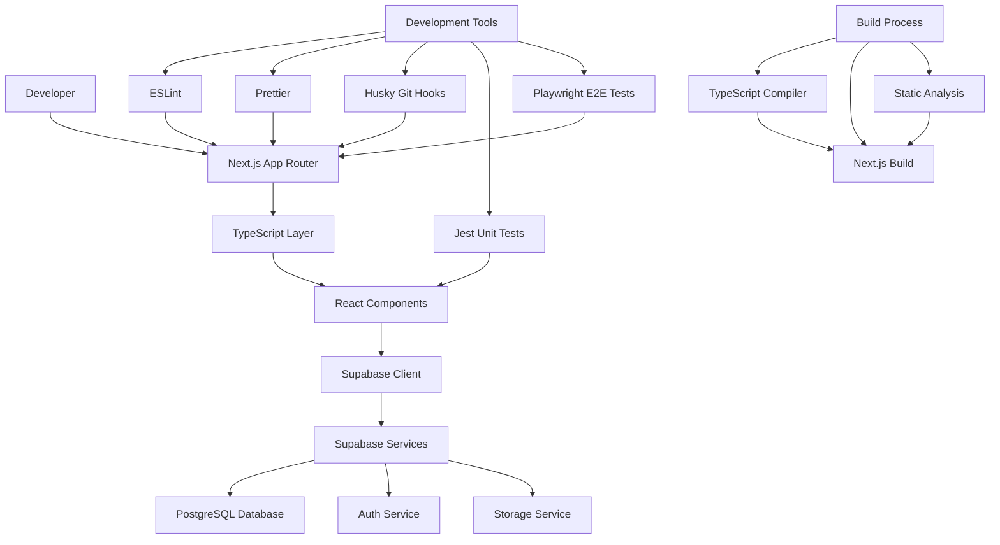

# Infrastructure Design Document

## Overview

Spider Mind v2 项目的基础设施设计定义了一个现代化、类型安全、高质量的全栈 Web 应用开发环境。该基础设施采用 Next.js 15 App Router 作为前端框架，Supabase 作为后端服务（BaaS），配合最严格的 TypeScript 配置和完整的代码质量保证体系，为项目提供可扩展、可维护的技术基础。

## Steering Document Alignment

### Technical Standards (tech.md)

- 遵循严格的 TypeScript 类型约束，禁止使用 `any` 类型
- 使用 yarn 作为包管理器确保依赖管理的一致性
- 采用现代化的 React 开发模式和最佳实践
- 建立统一的代码风格和质量标准

### Project Structure (structure.md)

- 采用 Next.js 15 App Router 的标准目录结构
- 分层架构设计，明确分离关注点
- 配置文件集中管理，环境变量统一配置
- 测试文件与源代码并行组织

## Code Reuse Analysis

### Existing Components to Leverage

- **Next.js 生态系统**: 利用 Next.js 内置的优化和功能
- **Supabase SDK**: 重用 Supabase 提供的客户端库和类型生成
- **React 生态系统**: 利用成熟的 React 组件库和工具链

### Integration Points

- **Supabase Database**: 通过 PostgreSQL 提供数据持久化
- **Supabase Auth**: 集成认证和授权服务
- **Supabase Storage**: 文件存储和媒体管理
- **Vercel/Netlify**: 部署和 CDN 集成

## Architecture

该基础设施采用现代化的全栈架构，前后端分离，通过 API 进行通信，同时集成完整的开发工具链和质量保证体系。



## Components and Interfaces

### Next.js Application Core

- **Purpose:** 提供前端应用框架和路由系统
- **Interfaces:**
  - App Router API for page routing
  - Server Components for SSR
  - Client Components for interactivity
  - API Routes for backend logic
- **Dependencies:** React 18+, TypeScript
- **Reuses:** Next.js 内置优化和工具链

### Supabase Integration Layer

- **Purpose:** 提供后端服务集成和数据管理
- **Interfaces:**
  - Database client for CRUD operations
  - Auth client for user management
  - Storage client for file operations
  - Real-time subscriptions
- **Dependencies:** @supabase/supabase-js
- **Reuses:** Supabase 提供的类型安全客户端

### TypeScript Configuration System

- **Purpose:** 确保类型安全和代码质量
- **Interfaces:**
  - Strict type checking rules
  - Path mapping for imports
  - Declaration file generation
- **Dependencies:** TypeScript 5+
- **Reuses:** TypeScript 编译器和类型系统

### Code Quality Enforcement Layer

- **Purpose:** 自动化代码格式化和质量检查
- **Interfaces:**
  - ESLint rules and plugins
  - Prettier formatting configuration
  - Git hooks for pre-commit checks
- **Dependencies:** ESLint, Prettier, Husky, lint-staged
- **Reuses:** 社区最佳实践配置

### Testing Infrastructure

- **Purpose:** 提供全面的测试能力
- **Interfaces:**
  - Jest test runner for unit tests
  - React Testing Library for component tests
  - Playwright for E2E tests
- **Dependencies:** Jest, @testing-library/react, Playwright
- **Reuses:** 成熟的测试工具生态系统

## Data Models

### Environment Configuration

```typescript
interface EnvironmentConfig {
  NEXT_PUBLIC_SUPABASE_URL: string;
  NEXT_PUBLIC_SUPABASE_ANON_KEY: string;
  SUPABASE_SERVICE_ROLE_KEY?: string;
  DATABASE_URL?: string;
  NODE_ENV: "development" | "production" | "test";
}
```

### Supabase Client Configuration

```typescript
interface SupabaseConfig {
  url: string;
  anonKey: string;
  options?: {
    auth: {
      autoRefreshToken: boolean;
      persistSession: boolean;
      detectSessionInUrl: boolean;
    };
    db: {
      schema: string;
    };
  };
}
```

### TypeScript Configuration

```typescript
interface TypeScriptConfig {
  compilerOptions: {
    target: string;
    lib: string[];
    allowJs: boolean;
    skipLibCheck: boolean;
    strict: boolean;
    noEmit: boolean;
    esModuleInterop: boolean;
    module: string;
    moduleResolution: string;
    resolveJsonModule: boolean;
    isolatedModules: boolean;
    jsx: string;
    incremental: boolean;
    plugins: Array<{
      name: string;
    }>;
    paths: Record<string, string[]>;
  };
  include: string[];
  exclude: string[];
}
```

### Testing Configuration

```typescript
interface JestConfig {
  testEnvironment: string;
  setupFilesAfterEnv: string[];
  moduleNameMapping: Record<string, string>;
  transform: Record<string, string>;
  testMatch: string[];
  collectCoverageFrom: string[];
}

interface PlaywrightConfig {
  testDir: string;
  timeout: number;
  fullyParallel: boolean;
  forbidOnly: boolean;
  retries: number;
  workers: number;
  reporter: string[];
  use: {
    baseURL: string;
    trace: string;
  };
  projects: Array<{
    name: string;
    use: Record<string, any>;
  }>;
}
```

## Error Handling

### Error Scenarios

1. **Supabase Connection Failure**
   - **Handling:** 实现连接重试机制，显示错误状态和重试选项
   - **User Impact:** 显示连接错误提示，提供重试按钮

2. **TypeScript Compilation Errors**
   - **Handling:** 提供详细错误信息，集成 IDE 智能提示
   - **User Impact:** 开发时实时错误反馈，阻止错误代码提交

3. **Code Quality Check Failures**
   - **Handling:** Git hooks 阻止提交，提供自动修复建议
   - **User Impact:** 提交前自动修复格式问题，手动解决逻辑问题

4. **Test Execution Failures**
   - **Handling:** 生成详细测试报告，提供失败截图和日志
   - **User Impact:** 清晰的测试失败原因，快速定位问题

5. **Build Process Failures**
   - **Handling:** 分阶段错误报告，提供具体修复步骤
   - **User Impact:** 详细的构建日志，明确的错误定位

6. **Environment Configuration Errors**
   - **Handling:** 启动时验证环境变量，提供配置检查工具
   - **User Impact:** 清晰的配置错误提示，配置验证工具

## Testing Strategy

### Unit Testing

- **Jest 配置**：支持 TypeScript、ES6 模块和 React 组件测试
- **测试覆盖率**：设置最低覆盖率阈值（80%）
- **关键组件测试**：
  - Supabase 客户端集成
  - 工具函数和帮助类
  - React 组件逻辑
  - 自定义 hooks
- **测试文件组织**：与源文件并行的 `__tests__` 目录
- **Mock 策略**：模拟外部依赖和 API 调用

### Integration Testing

- **API 集成测试**：测试 Supabase 服务集成
- **组件集成测试**：测试组件间交互
- **数据流测试**：验证完整的数据处理流程
- **认证流程测试**：测试用户认证和授权
- **测试环境**：使用测试数据库和模拟服务

### End-to-End Testing

- **Playwright 配置**：多浏览器支持（Chrome、Firefox、Safari）
- **用户场景测试**：
  - 用户注册和登录流程
  - 核心功能完整流程
  - 响应式设计测试
  - 性能和可访问性测试
- **测试数据管理**：自动化测试数据生成和清理
- **CI/CD 集成**：在持续集成中自动执行 E2E 测试
- **测试报告**：生成详细的测试报告和失败截图

### Test Automation Strategy

- **Pre-commit 测试**：快速单元测试套件
- **CI/CD Pipeline 测试**：完整测试套件包括集成和 E2E 测试
- **定期测试**：夜间完整测试运行
- **性能测试**：定期性能基准测试
- **可视化回归测试**：UI 变更的视觉验证

## Implementation Details

### Project Structure

```
spider-mind-v2/
├── app/                          # Next.js App Router
│   ├── globals.css              # 全局样式
│   ├── layout.tsx               # 根布局组件
│   ├── page.tsx                 # 首页
│   ├── api/                     # API 路由
│   └── (dashboard)/             # 路由组
├── components/                   # React 组件
│   ├── ui/                      # UI 基础组件
│   └── features/                # 功能组件
├── lib/                         # 工具库和配置
│   ├── supabase/                # Supabase 配置和工具
│   ├── utils/                   # 通用工具函数
│   └── types/                   # TypeScript 类型定义
├── tests/                       # 测试文件
│   ├── unit/                    # 单元测试
│   ├── integration/             # 集成测试
│   └── e2e/                     # E2E 测试
├── public/                      # 静态资源
├── .next/                       # Next.js 构建输出
├── node_modules/                # 依赖包
├── package.json                 # 包管理配置
├── tsconfig.json               # TypeScript 配置
├── next.config.js              # Next.js 配置
├── tailwind.config.js          # Tailwind CSS 配置
├── jest.config.js              # Jest 配置
├── playwright.config.ts        # Playwright 配置
├── .eslintrc.json              # ESLint 配置
├── .prettierrc                 # Prettier 配置
├── .env.local                  # 环境变量
└── README.md                   # 项目文档
```

### Key Configuration Files

#### TypeScript Configuration (tsconfig.json)

```json
{
  "compilerOptions": {
    "lib": ["dom", "dom.iterable", "es6"],
    "allowJs": true,
    "skipLibCheck": true,
    "strict": true,
    "noEmit": true,
    "esModuleInterop": true,
    "module": "esnext",
    "moduleResolution": "bundler",
    "resolveJsonModule": true,
    "isolatedModules": true,
    "jsx": "preserve",
    "incremental": true,
    "plugins": [
      {
        "name": "next"
      }
    ],
    "baseUrl": ".",
    "paths": {
      "@/*": ["./*"],
      "@/components/*": ["./components/*"],
      "@/lib/*": ["./lib/*"],
      "@/app/*": ["./app/*"]
    }
  },
  "include": ["next-env.d.ts", "**/*.ts", "**/*.tsx", ".next/types/**/*.ts"],
  "exclude": ["node_modules"]
}
```

#### ESLint Configuration (.eslintrc.json)

```json
{
  "extends": [
    "next/core-web-vitals",
    "@typescript-eslint/recommended",
    "prettier"
  ],
  "plugins": ["@typescript-eslint"],
  "rules": {
    "@typescript-eslint/no-explicit-any": "error",
    "@typescript-eslint/no-unused-vars": "error",
    "@typescript-eslint/explicit-function-return-type": "warn",
    "prefer-const": "error",
    "no-var": "error"
  }
}
```

#### Package.json Scripts

```json
{
  "scripts": {
    "dev": "next dev",
    "build": "next build",
    "start": "next start",
    "lint": "next lint",
    "lint:fix": "next lint --fix",
    "type-check": "tsc --noEmit",
    "test": "jest",
    "test:watch": "jest --watch",
    "test:coverage": "jest --coverage",
    "test:e2e": "playwright test",
    "test:e2e:ui": "playwright test --ui",
    "prepare": "husky install"
  }
}
```

### Development Workflow

1. **环境搭建**：克隆项目 → 安装依赖 → 配置环境变量
2. **开发流程**：功能开发 → 单元测试 → 代码检查 → 提交前验证
3. **提交流程**：Git add → Pre-commit hooks → 代码格式化 → Lint 检查 → 提交
4. **持续集成**：代码推送 → 自动测试 → 构建验证 → 部署准备
5. **质量保证**：代码审查 → E2E 测试 → 性能测试 → 发布验证
