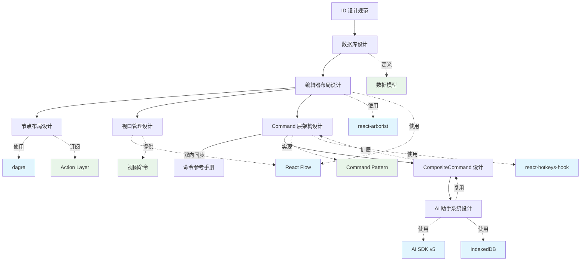

# 设计文档索引

本索引列出所有系统设计和架构文档，按模块分类组织，便于快速查找和理解系统设计全貌。

## 📋 文档概览

| 文档名称                                                    | 描述                      | 状态      | 最后更新   |
| ----------------------------------------------------------- | ------------------------- | --------- | ---------- |
| [ID 设计规范](./id-design.md)                               | 系统 ID 生成和管理机制    | ✅ 已确认 | 2025-01-07 |
| [数据库设计](./database-schema.md)                          | 数据库表结构和约束设计    | ✅ 已确认 | 2025-11-06 |
| [思维导图编辑器布局设计](./mindmap-editor-layout-design.md) | 编辑器界面布局和组件协作  | ✅ 已确认 | 2025-10-19 |
| [思维导图节点布局设计](./mindmap-layout-design.md)          | 节点布局计算引擎和服务    | ✅ 已确认 | 2025-01-23 |
| [视口管理设计](./viewport-management-design.md)             | 视口状态管理和双向同步    | ✅ 已确认 | 2025-11-23 |
| [Command 层架构设计](./command-layer-design.md)             | 命令系统架构和实现        | ✅ 已确认 | 2025-11-23 |
| [命令参考手册](./command-reference.md)                      | 所有命令和快捷键快速查询  | ✅ 已确认 | 2025-11-23 |
| [CompositeCommand 设计](./composite-command.md)             | 组合命令系统设计和实现    | ✅ 已确认 | 2025-11-15 |
| [AI 助手系统设计](./ai-assistant-system-design.md)          | AI 对话、操作执行和持久化 | ✅ 已确认 | 2025-11-16 |

## 🏗️ 按模块分类

### 核心基础设施

#### ID 机制

- **[ID 设计规范](./id-design.md)**
  - UUID 作为主键设计
  - short_id 生成策略（6字符 base36）
  - 范围唯一性保证
  - 前端/后端生成策略

#### 数据库设计

- **[数据库设计](./database-schema.md)**
  - 用户档案表（user_profiles）
  - 思维导图表（mindmaps）
  - 思维导图节点表（mindmap_nodes）
  - 约束、索引和触发器设计

### 前端架构

#### 编辑器布局和组件

- **[思维导图编辑器布局设计](./mindmap-editor-layout-design.md)**
  - 三栏式编辑器界面
  - 可调整宽度面板
  - 虚拟化大纲视图（react-arborist）
  - 图形视图（React Flow）
  - 折叠节点高亮和导航
  - 布局状态持久化

#### 节点布局计算

- **[思维导图节点布局设计](./mindmap-layout-design.md)**
  - Engine + Service 分离架构
  - DagreLayoutEngine 布局算法
  - 节点尺寸缓存和测量
  - Action 订阅机制（自动响应）
  - order_index 排序和同级对齐

#### 视口管理

- **[视口管理设计](./viewport-management-design.md)**
  - 节点坐标系与屏幕坐标系转换
  - Store ↔ React Flow 双向同步
  - 基于值比较的防抖同步机制
  - 视口缩放、平移、聚焦命令
  - 节点可见性检测和自动聚焦

#### 命令系统和快捷键

- **[Command 层架构设计](./command-layer-design.md)**
  - 命令模式（Command Pattern）实现
  - ActionBasedCommandDefinition 和 ImperativeCommandDefinition
  - CommandManager 和执行流程
  - 条件执行（when）和撤销支持

- **[命令参考手册](./command-reference.md)**
  - 32个已实现命令
  - 命令分类（节点操作、导航操作、视图操作、全局操作）
  - 快捷键绑定和上下文感知
  - 完整的命令列表和使用说明
  - 添加新命令的最佳实践

- **[CompositeCommand 设计](./composite-command.md)**
  - 组合命令（批量操作）实现
  - 原子性和可撤销性保证
  - AI 批量操作集成
  - 严格的全或无错误处理

#### AI 助手系统

- **[AI 助手系统设计](./ai-assistant-system-design.md)**
  - AI 对话历史持久化（IndexedDB + Supabase）
  - AI 操作建议执行系统
  - 基于 Command 系统的操作执行
  - 操作状态管理和确认机制
  - LLM 提示词设计和细粒度操作策略

## 🔗 文档关系图

**图例**:

- 绿色：设计概念
- 蓝色：外部依赖

## 📊 设计决策记录

### 已确定的技术选型

| 领域           | 技术选择            | 理由                                | 相关文档                                            |
| -------------- | ------------------- | ----------------------------------- | --------------------------------------------------- |
| **ID 生成**    | UUID + short_id     | 兼顾唯一性和用户友好性              | [ID 设计](./id-design.md)                           |
| **数据库**     | PostgreSQL/Supabase | 开源、实时同步、完整的关系型特性    | [数据库设计](./database-schema.md)                  |
| **状态管理**   | Zustand + Immer     | 轻量级、类型安全、不可变更新        | [编辑器布局设计](./mindmap-editor-layout-design.md) |
| **命令模式**   | Command Pattern     | 解耦触发与逻辑、可扩展              | [命令参考](./command-reference.md)                  |
| **快捷键**     | react-hotkeys-hook  | Hook API、轻量级、TypeScript 支持   | [命令参考](./command-reference.md)                  |
| **大纲视图**   | react-arborist      | 虚拟化渲染、类型安全                | [布局设计](./mindmap-editor-layout-design.md)       |
| **图形渲染**   | React Flow          | 成熟稳定、丰富功能                  | [布局设计](./mindmap-editor-layout-design.md)       |
| **尺寸监听**   | ResizeObserver      | 原生 API、性能优秀                  | [布局设计](./mindmap-editor-layout-design.md)       |
| **布局持久化** | localStorage        | 快速响应、离线可用                  | [布局设计](./mindmap-editor-layout-design.md)       |
| **AI 集成**    | AI SDK v5           | 流式响应、React Hooks、类型安全     | [AI 助手系统](./ai-assistant-system-design.md)      |
| **本地存储**   | IndexedDB (idb)     | 大容量、异步 API、离线优先          | [AI 助手系统](./ai-assistant-system-design.md)      |
| **节点布局**   | dagre               | 成熟的分层布局算法、TypeScript 支持 | [节点布局设计](./mindmap-layout-design.md)          |

### 核心设计原则

1. **领域驱动设计** - 基于业务领域建模，而非技术实现
2. **类型安全** - 充分利用 TypeScript 类型系统
3. **渐进增强** - 优先保证离线功能，在线功能作为增强
4. **数据一致性** - 通过约束和验证保证数据完整性

## 🚧 待完成的设计文档

根据项目发展需要，以下文档待创建：

### 高优先级

- [ ] **架构概览** (`architecture-overview.md`) - 系统整体架构图和说明
- [ ] **API 设计** (`api-design.md`) - Server Actions 和 API 接口规范

### 中优先级

- [ ] **认证授权设计** (`auth-design.md`) - 用户认证和权限管理
- [ ] **同步机制设计** (`sync-design.md`) - 本地与云端数据同步方案

### 低优先级

- [ ] **部署架构** (`deployment-architecture.md`) - 生产环境部署方案
- [ ] **监控告警设计** (`monitoring-design.md`) - 系统监控和告警策略

## 📝 文档编写指南

### 新建设计文档时应包含

1. **元信息**: 版本、日期、作者、相关文档
2. **关键概念**: 定义该设计引入的新概念
3. **概述**: 一句话说明设计目的
4. **背景和动机**: 为什么需要这个设计
5. **设计方案**: 详细的技术方案
6. **实现要点**: 关键注意事项
7. **使用示例**: 精简的代码示例
8. **设计决策**: 重要决策及理由
9. **参考资料**: 相关链接

### 文档质量要求

- ✅ 结构清晰，层次分明
- ✅ 概念定义准确
- ✅ 示例代码精简（避免冗余）
- ✅ 保持与其他文档的一致性
- ✅ 及时更新以反映实现变化

## 🔍 快速查找

### 按关键词索引

| 关键词                                 | 相关文档                                        |
| -------------------------------------- | ----------------------------------------------- |
| UUID, short_id, 唯一性, base36         | [ID 设计](./id-design.md)                       |
| 数据库, Schema, PostgreSQL, Supabase   | [数据库设计](./database-schema.md)              |
| mindmaps, mindmap_nodes, user_profiles | [数据库设计](./database-schema.md)              |
| 约束, 索引, 触发器, 外键               | [数据库设计](./database-schema.md)              |
| Command Pattern, 命令模式              | [Command 层架构](./command-layer-design.md)     |
| ActionBased, ImperativeCommand         | [Command 层架构](./command-layer-design.md)     |
| CommandManager, 命令执行               | [Command 层架构](./command-layer-design.md)     |
| 快捷键, react-hotkeys-hook, 键盘事件   | [命令参考](./command-reference.md)              |
| 节点操作, 导航, 编辑命令               | [命令参考](./command-reference.md)              |
| CompositeCommand, 组合命令, 批量操作   | [CompositeCommand 设计](./composite-command.md) |
| 原子性, 可撤销性, AI 批量操作          | [CompositeCommand 设计](./composite-command.md) |
| 布局, 三栏, 大纲视图, 图形视图         | [布局设计](./mindmap-editor-layout-design.md)   |
| react-arborist, 虚拟化, Tree           | [布局设计](./mindmap-editor-layout-design.md)   |
| React Flow, 图形渲染                   | [布局设计](./mindmap-editor-layout-design.md)   |
| ResizeObserver, 响应式                 | [布局设计](./mindmap-editor-layout-design.md)   |
| localStorage, 布局持久化               | [布局设计](./mindmap-editor-layout-design.md)   |
| 折叠节点, 高亮, 导航                   | [布局设计](./mindmap-editor-layout-design.md)   |
| Zustand, Immer, 状态管理               | [布局设计](./mindmap-editor-layout-design.md)   |
| AI SDK, useChat, 流式响应              | [AI 助手系统](./ai-assistant-system-design.md)  |
| AIMessage, AIOperation, 对话持久化     | [AI 助手系统](./ai-assistant-system-design.md)  |
| IndexedDB, idb, 本地存储               | [AI 助手系统](./ai-assistant-system-design.md)  |
| operationsApplied, metadata, 操作状态  | [AI 助手系统](./ai-assistant-system-design.md)  |
| LLM, 提示词, 系统提示                  | [AI 助手系统](./ai-assistant-system-design.md)  |
| LayoutEngine, LayoutService, 布局计算  | [节点布局设计](./mindmap-layout-design.md)      |
| NodeLayout, NodeSize, SizeGetter       | [节点布局设计](./mindmap-layout-design.md)      |
| dagre, 分层布局, 同级对齐              | [节点布局设计](./mindmap-layout-design.md)      |
| order_index, 兄弟节点排序              | [节点布局设计](./mindmap-layout-design.md)      |
| Action 订阅, 自动响应                  | [节点布局设计](./mindmap-layout-design.md)      |
| Viewport, 视口, 坐标系转换             | [视口管理设计](./viewport-management-design.md) |
| 双向同步, 值比较, 防抖                 | [视口管理设计](./viewport-management-design.md) |
| 缩放, 平移, 聚焦, fitView              | [视口管理设计](./viewport-management-design.md) |
| 节点可见性, ensureNodeVisible          | [视口管理设计](./viewport-management-design.md) |
| SetViewportAction, 视图命令            | [视口管理设计](./viewport-management-design.md) |

### 常见问题对应文档

| 问题                                    | 查看文档                                        |
| --------------------------------------- | ----------------------------------------------- |
| 如何生成唯一 ID？                       | [ID 设计](./id-design.md)                       |
| 数据库表结构是什么？                    | [数据库设计](./database-schema.md)              |
| 如何设计数据模型？                      | [数据库设计](./database-schema.md)              |
| 命令系统如何设计？                      | [Command 层架构](./command-layer-design.md)     |
| ActionBased 和 Imperative 命令的区别？  | [Command 层架构](./command-layer-design.md)     |
| 有哪些可用的命令？                      | [命令参考](./command-reference.md)              |
| 如何实现快捷键？                        | [命令参考](./command-reference.md)              |
| 如何添加新命令？                        | [命令参考](./command-reference.md)              |
| 如何实现批量操作？                      | [CompositeCommand 设计](./composite-command.md) |
| 如何保证批量操作的原子性？              | [CompositeCommand 设计](./composite-command.md) |
| AI 批量操作如何集成？                   | [CompositeCommand 设计](./composite-command.md) |
| 如何实现编辑器布局？                    | [布局设计](./mindmap-editor-layout-design.md)   |
| 如何实现虚拟化大纲视图？                | [布局设计](./mindmap-editor-layout-design.md)   |
| 如何实现图形视图？                      | [布局设计](./mindmap-editor-layout-design.md)   |
| 如何实现可调整宽度面板？                | [布局设计](./mindmap-editor-layout-design.md)   |
| 如何实现折叠节点高亮？                  | [布局设计](./mindmap-editor-layout-design.md)   |
| 如何保存用户布局偏好？                  | [布局设计](./mindmap-editor-layout-design.md)   |
| 如何管理思维导图状态？                  | [布局设计](./mindmap-editor-layout-design.md)   |
| 如何优化大量节点的性能？                | [布局设计](./mindmap-editor-layout-design.md)   |
| AI 对话如何持久化？                     | [AI 助手系统](./ai-assistant-system-design.md)  |
| AI 操作如何执行？                       | [AI 助手系统](./ai-assistant-system-design.md)  |
| 如何避免重复执行 AI 操作？              | [AI 助手系统](./ai-assistant-system-design.md)  |
| AI 消息如何同步到云端？                 | [AI 助手系统](./ai-assistant-system-design.md)  |
| 如何设计 LLM 提示词？                   | [AI 助手系统](./ai-assistant-system-design.md)  |
| 节点布局如何计算？                      | [节点布局设计](./mindmap-layout-design.md)      |
| 如何实现布局引擎？                      | [节点布局设计](./mindmap-layout-design.md)      |
| 如何响应节点变化自动更新布局？          | [节点布局设计](./mindmap-layout-design.md)      |
| 兄弟节点如何排序和对齐？                | [节点布局设计](./mindmap-layout-design.md)      |
| 如何管理视口状态？                      | [视口管理设计](./viewport-management-design.md) |
| 如何实现 Store 和 React Flow 双向同步？ | [视口管理设计](./viewport-management-design.md) |
| 如何防止视口同步循环？                  | [视口管理设计](./viewport-management-design.md) |
| 如何实现缩放、平移命令？                | [视口管理设计](./viewport-management-design.md) |
| 如何确保节点在视口中可见？              | [视口管理设计](./viewport-management-design.md) |
| 节点坐标系和屏幕坐标系如何转换？        | [视口管理设计](./viewport-management-design.md) |

## 📅 更新记录

| 日期       | 更新内容                                                              | 更新者      |
| ---------- | --------------------------------------------------------------------- | ----------- |
| 2025-11-23 | 更新 Action 层设计（双层订阅机制）和布局设计（布局预测与精确化）      | Claude Code |
| 2025-11-23 | 添加视口管理设计文档、更新命令层架构和命令参考手册（视图操作命令）    | Claude Code |
| 2025-01-23 | 添加思维导图节点布局设计文档（Engine + Service 架构）                 | Claude Code |
| 2025-11-16 | 添加 AI 助手系统设计文档（整合对话持久化、操作执行、UI 设计）         | Claude Code |
| 2025-11-15 | 添加 CompositeCommand 设计文档、更新 Command 层架构设计和命令参考手册 | Claude Code |
| 2025-10-19 | 添加命令系统、快捷键系统设计文档和命令参考手册                        | Claude Code |
| 2025-10-19 | 添加思维导图编辑器布局设计文档                                        | Claude Code |
| 2025-10-18 | 添加思维导图持久化系统设计文档                                        | Claude Code |
| 2025-01-07 | 创建索引文档                                                          | Claude Code |

---

**维护说明**:

- 添加新设计文档后，请更新本索引
- 定期检查文档链接的有效性
- 保持分类和标签的一致性
