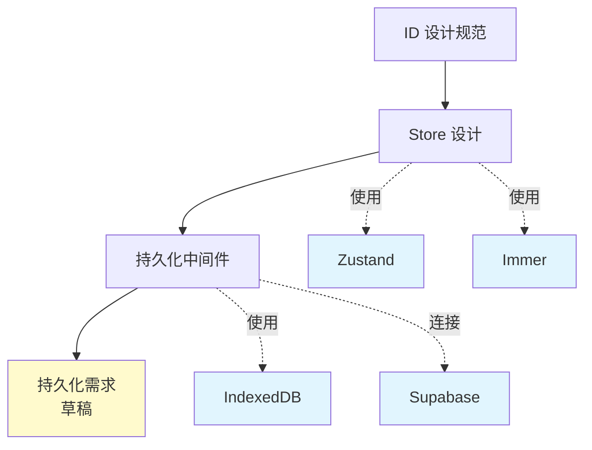

# 设计文档索引

本索引列出所有系统设计和架构文档，按模块分类组织，便于快速查找和理解系统设计全貌。

## 📋 文档概览

| 文档名称 | 描述 | 状态 | 最后更新 |
|---------|------|------|---------|
| [ID 设计规范](./id-design.md) | 系统 ID 生成和管理机制 | ✅ 已确认 | 2025-01-07 |
| [思维导图编辑器 Store 设计](./mindmap-editor-store-design.md) | 编辑器状态管理架构 | ✅ 已确认 | 2025-01-06 |
| [IndexedDB 持久化中间件设计](./indexeddb-persistence-middleware-design.md) | 本地数据持久化方案 | ✅ 已确认 | 2025-01-04 |

## 🏗️ 按模块分类

### 核心基础设施

#### ID 机制
- **[ID 设计规范](./id-design.md)**
  - UUID 作为主键设计
  - short_id 生成策略（10字符 base36）
  - 范围唯一性保证
  - 前端/后端生成策略

### 数据管理

#### 状态管理
- **[思维导图编辑器 Store 设计](./mindmap-editor-store-design.md)**
  - Zustand + Immer 架构
  - 领域驱动的状态设计
  - 节点操作和约束保证
  - 焦点与选中机制

#### 数据持久化
- **[IndexedDB 持久化中间件设计](./indexeddb-persistence-middleware-design.md)**
  - 双层数据架构（本地缓存 + 云端）
  - 自动同步机制
  - 冲突解决策略
  - 离线支持方案

### 草稿文档（待确认）

- **[思维导图持久化需求](../draft/mindmap-persistence-requirements.md)** *(草稿)*
  - 详细的持久化功能需求分析
  - 包含1400+行的详细规格说明

## 🔗 文档关系图

**图例**:
- 黄色：草稿文档
- 蓝色：外部依赖

## 📊 设计决策记录

### 已确定的技术选型

| 领域 | 技术选择 | 理由 | 相关文档 |
|------|---------|------|---------|
| **ID 生成** | UUID + short_id | 兼顾唯一性和用户友好性 | [ID 设计](./id-design.md) |
| **状态管理** | Zustand + Immer | 轻量级、类型安全、不可变更新 | [Store 设计](./mindmap-editor-store-design.md) |
| **本地存储** | IndexedDB | 大容量、结构化、离线支持 | [持久化中间件](./indexeddb-persistence-middleware-design.md) |
| **云端存储** | Supabase | 开源、实时同步、PostgreSQL | [Supabase 配置](../setup/supabase-local-setup.md) |

### 核心设计原则

1. **领域驱动设计** - 基于业务领域建模，而非技术实现
2. **类型安全** - 充分利用 TypeScript 类型系统
3. **渐进增强** - 优先保证离线功能，在线功能作为增强
4. **数据一致性** - 通过约束和验证保证数据完整性

## 🚧 待完成的设计文档

根据结构分析报告，以下文档需要创建：

### 高优先级
- [ ] **架构概览** (`architecture-overview.md`) - 系统整体架构图和说明
- [ ] **数据库设计** (`database-schema.md`) - 完整的数据模型设计

### 中优先级
- [ ] **API 设计** - RESTful API 接口规范
- [ ] **认证授权设计** - 用户认证和权限管理

### 低优先级
- [ ] **部署架构** - 生产环境部署方案
- [ ] **监控告警设计** - 系统监控和告警策略

## 📝 文档编写指南

### 新建设计文档时应包含

1. **元信息**: 版本、日期、作者、相关文档
2. **关键概念**: 定义该设计引入的新概念
3. **概述**: 一句话说明设计目的
4. **背景和动机**: 为什么需要这个设计
5. **设计方案**: 详细的技术方案
6. **实现要点**: 关键注意事项
7. **使用示例**: 精简的代码示例
8. **设计决策**: 重要决策及理由
9. **参考资料**: 相关链接

### 文档质量要求

- ✅ 结构清晰，层次分明
- ✅ 概念定义准确
- ✅ 示例代码精简（避免冗余）
- ✅ 保持与其他文档的一致性
- ✅ 及时更新以反映实现变化

## 🔍 快速查找

### 按关键词索引

| 关键词 | 相关文档 |
|--------|---------|
| UUID, short_id, 唯一性 | [ID 设计](./id-design.md) |
| Zustand, Immer, 状态管理 | [Store 设计](./mindmap-editor-store-design.md) |
| IndexedDB, 离线, 同步 | [持久化中间件](./indexeddb-persistence-middleware-design.md) |
| 节点, 树结构, order_index | [Store 设计](./mindmap-editor-store-design.md) |
| 冲突解决, 数据同步 | [持久化中间件](./indexeddb-persistence-middleware-design.md) |

### 常见问题对应文档

| 问题 | 查看文档 |
|------|---------|
| 如何生成唯一 ID？ | [ID 设计](./id-design.md) |
| 如何管理思维导图状态？ | [Store 设计](./mindmap-editor-store-design.md) |
| 如何实现离线功能？ | [持久化中间件](./indexeddb-persistence-middleware-design.md) |
| 如何处理数据同步冲突？ | [持久化中间件](./indexeddb-persistence-middleware-design.md) |

## 📅 更新记录

| 日期 | 更新内容 | 更新者 |
|------|---------|--------|
| 2025-01-07 | 创建索引文档 | Claude Code |

---

**维护说明**:
- 添加新设计文档后，请更新本索引
- 定期检查文档链接的有效性
- 保持分类和标签的一致性