# 设计文档索引

本索引列出所有系统设计和架构文档，按模块分类组织，便于快速查找和理解系统设计全貌。

## 📋 文档概览

| 文档名称                                                                   | 描述                     | 状态      | 最后更新   |
| -------------------------------------------------------------------------- | ------------------------ | --------- | ---------- |
| [ID 设计规范](./id-design.md)                                              | 系统 ID 生成和管理机制   | ✅ 已确认 | 2025-01-07 |
| [思维导图编辑器 Store 设计](./mindmap-editor-store-design.md)              | 编辑器状态管理架构       | ✅ 已确认 | 2025-01-06 |
| [思维导图编辑器布局设计](./mindmap-editor-layout-design.md)                | 编辑器界面布局和组件协作 | ✅ 已确认 | 2025-10-19 |
| [IndexedDB 持久化中间件设计](./indexeddb-persistence-middleware-design.md) | 本地数据持久化方案       | ✅ 已确认 | 2025-01-04 |
| [思维导图持久化系统设计](./mindmap-persistence-design.md)                  | 三层数据流架构和同步机制 | ✅ 已确认 | 2025-10-18 |

## 🏗️ 按模块分类

### 核心基础设施

#### ID 机制

- **[ID 设计规范](./id-design.md)**
  - UUID 作为主键设计
  - short_id 生成策略（10字符 base36）
  - 范围唯一性保证
  - 前端/后端生成策略

### 前端 UI

#### 布局和组件

- **[思维导图编辑器布局设计](./mindmap-editor-layout-design.md)**
  - 三栏式编辑器界面
  - 可调整宽度面板
  - 虚拟化大纲视图（react-arborist）
  - 图形视图（React Flow）
  - 折叠节点高亮和导航
  - 布局状态持久化

### 数据管理

#### 状态管理

- **[思维导图编辑器 Store 设计](./mindmap-editor-store-design.md)**
  - Zustand + Immer 架构
  - 领域驱动的状态设计
  - 节点操作和约束保证
  - 焦点与选中机制

#### 数据持久化

- **[IndexedDB 持久化中间件设计](./indexeddb-persistence-middleware-design.md)**
  - 双层数据架构（本地缓存 + 云端）
  - 自动同步机制
  - 冲突解决策略
  - 离线支持方案
- **[思维导图持久化系统设计](./mindmap-persistence-design.md)**
  - 三层数据流架构（Store → IndexedDB → Supabase）
  - Auto-Persistence 中间件实现
  - 脏数据追踪和批量同步
  - 时间戳冲突检测机制
  - 拓扑排序节点上传策略

### 草稿文档（待确认）

- **[思维导图持久化需求](../draft/mindmap-persistence-requirements.md)** _(草稿)_
  - 详细的持久化功能需求分析
  - 包含1400+行的详细规格说明

## 🔗 文档关系图

```mermaid
graph TD
    A[ID 设计规范] --> B[Store 设计]
    B --> C[持久化中间件]
    C --> D[持久化需求<br/>草稿]
    D --> I[持久化系统设计]

    B --> J[布局设计]

    B -.->|使用| E[Zustand]
    B -.->|使用| F[Immer]
    C -.->|使用| G[IndexedDB]
    C -.->|连接| H[Supabase]
    I -.->|使用| G
    I -.->|使用| H
    I -.->|实现| C

    J -.->|读取| B
    J -.->|使用| K[react-arborist]
    J -.->|使用| L[React Flow]

    style D fill:#fffacd
    style E fill:#e1f5fe
    style F fill:#e1f5fe
    style G fill:#e1f5fe
    style H fill:#e1f5fe
    style K fill:#e1f5fe
    style L fill:#e1f5fe
```

**图例**:

- 黄色：草稿文档
- 蓝色：外部依赖

## 📊 设计决策记录

### 已确定的技术选型

| 领域           | 技术选择        | 理由                         | 相关文档                                                     |
| -------------- | --------------- | ---------------------------- | ------------------------------------------------------------ |
| **ID 生成**    | UUID + short_id | 兼顾唯一性和用户友好性       | [ID 设计](./id-design.md)                                    |
| **状态管理**   | Zustand + Immer | 轻量级、类型安全、不可变更新 | [Store 设计](./mindmap-editor-store-design.md)               |
| **本地存储**   | IndexedDB       | 大容量、结构化、离线支持     | [持久化中间件](./indexeddb-persistence-middleware-design.md) |
| **云端存储**   | Supabase        | 开源、实时同步、PostgreSQL   | [Supabase 配置](../setup/supabase-local-setup.md)            |
| **大纲视图**   | react-arborist  | 虚拟化渲染、类型安全         | [布局设计](./mindmap-editor-layout-design.md)                |
| **图形渲染**   | React Flow      | 成熟稳定、丰富功能           | [布局设计](./mindmap-editor-layout-design.md)                |
| **尺寸监听**   | ResizeObserver  | 原生 API、性能优秀           | [布局设计](./mindmap-editor-layout-design.md)                |
| **布局持久化** | localStorage    | 快速响应、离线可用           | [布局设计](./mindmap-editor-layout-design.md)                |

### 核心设计原则

1. **领域驱动设计** - 基于业务领域建模，而非技术实现
2. **类型安全** - 充分利用 TypeScript 类型系统
3. **渐进增强** - 优先保证离线功能，在线功能作为增强
4. **数据一致性** - 通过约束和验证保证数据完整性

## 🚧 待完成的设计文档

根据结构分析报告，以下文档需要创建：

### 高优先级

- [ ] **架构概览** (`architecture-overview.md`) - 系统整体架构图和说明
- [ ] **数据库设计** (`database-schema.md`) - 完整的数据模型设计

### 中优先级

- [ ] **API 设计** - RESTful API 接口规范
- [ ] **认证授权设计** - 用户认证和权限管理

### 低优先级

- [ ] **部署架构** - 生产环境部署方案
- [ ] **监控告警设计** - 系统监控和告警策略

## 📝 文档编写指南

### 新建设计文档时应包含

1. **元信息**: 版本、日期、作者、相关文档
2. **关键概念**: 定义该设计引入的新概念
3. **概述**: 一句话说明设计目的
4. **背景和动机**: 为什么需要这个设计
5. **设计方案**: 详细的技术方案
6. **实现要点**: 关键注意事项
7. **使用示例**: 精简的代码示例
8. **设计决策**: 重要决策及理由
9. **参考资料**: 相关链接

### 文档质量要求

- ✅ 结构清晰，层次分明
- ✅ 概念定义准确
- ✅ 示例代码精简（避免冗余）
- ✅ 保持与其他文档的一致性
- ✅ 及时更新以反映实现变化

## 🔍 快速查找

### 按关键词索引

| 关键词                         | 相关文档                                                                                                    |
| ------------------------------ | ----------------------------------------------------------------------------------------------------------- |
| UUID, short_id, 唯一性         | [ID 设计](./id-design.md)                                                                                   |
| Zustand, Immer, 状态管理       | [Store 设计](./mindmap-editor-store-design.md)                                                              |
| IndexedDB, 离线, 同步          | [持久化中间件](./indexeddb-persistence-middleware-design.md), [持久化系统](./mindmap-persistence-design.md) |
| 节点, 树结构, order_index      | [Store 设计](./mindmap-editor-store-design.md)                                                              |
| 冲突解决, 数据同步             | [持久化中间件](./indexeddb-persistence-middleware-design.md), [持久化系统](./mindmap-persistence-design.md) |
| 脏数据, 三层架构, 中间件       | [持久化系统](./mindmap-persistence-design.md)                                                               |
| 时间戳冲突检测, 拓扑排序       | [持久化系统](./mindmap-persistence-design.md)                                                               |
| Supabase, 云端同步             | [持久化系统](./mindmap-persistence-design.md)                                                               |
| 布局, 三栏, 大纲视图, 图形视图 | [布局设计](./mindmap-editor-layout-design.md)                                                               |
| react-arborist, 虚拟化, Tree   | [布局设计](./mindmap-editor-layout-design.md)                                                               |
| React Flow, 图形渲染           | [布局设计](./mindmap-editor-layout-design.md)                                                               |
| ResizeObserver, 响应式         | [布局设计](./mindmap-editor-layout-design.md)                                                               |
| localStorage, 布局持久化       | [布局设计](./mindmap-editor-layout-design.md)                                                               |
| 折叠节点, 高亮, 导航           | [布局设计](./mindmap-editor-layout-design.md)                                                               |

### 常见问题对应文档

| 问题                     | 查看文档                                                                                                    |
| ------------------------ | ----------------------------------------------------------------------------------------------------------- |
| 如何生成唯一 ID？        | [ID 设计](./id-design.md)                                                                                   |
| 如何管理思维导图状态？   | [Store 设计](./mindmap-editor-store-design.md)                                                              |
| 如何实现编辑器布局？     | [布局设计](./mindmap-editor-layout-design.md)                                                               |
| 如何实现虚拟化大纲视图？ | [布局设计](./mindmap-editor-layout-design.md)                                                               |
| 如何实现图形视图？       | [布局设计](./mindmap-editor-layout-design.md)                                                               |
| 如何实现可调整宽度面板？ | [布局设计](./mindmap-editor-layout-design.md)                                                               |
| 如何实现折叠节点高亮？   | [布局设计](./mindmap-editor-layout-design.md)                                                               |
| 如何保存用户布局偏好？   | [布局设计](./mindmap-editor-layout-design.md)                                                               |
| 如何实现离线功能？       | [持久化中间件](./indexeddb-persistence-middleware-design.md), [持久化系统](./mindmap-persistence-design.md) |
| 如何处理数据同步冲突？   | [持久化中间件](./indexeddb-persistence-middleware-design.md), [持久化系统](./mindmap-persistence-design.md) |
| 如何实现自动持久化？     | [持久化系统](./mindmap-persistence-design.md)                                                               |
| 如何追踪脏数据？         | [持久化系统](./mindmap-persistence-design.md)                                                               |
| 如何同步到 Supabase？    | [持久化系统](./mindmap-persistence-design.md)                                                               |
| 如何优化大量节点的性能？ | [布局设计](./mindmap-editor-layout-design.md), [Store 设计](./mindmap-editor-store-design.md)               |

## 📅 更新记录

| 日期       | 更新内容                       | 更新者      |
| ---------- | ------------------------------ | ----------- |
| 2025-10-19 | 添加思维导图编辑器布局设计文档 | Claude Code |
| 2025-10-18 | 添加思维导图持久化系统设计文档 | Claude Code |
| 2025-01-07 | 创建索引文档                   | Claude Code |

---

**维护说明**:

- 添加新设计文档后，请更新本索引
- 定期检查文档链接的有效性
- 保持分类和标签的一致性
