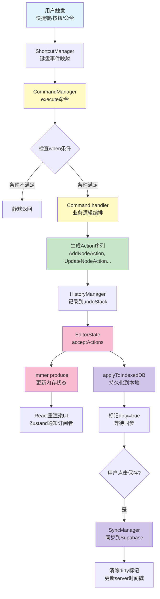

# 领域层架构设计

## 元信息

- 创建日期: 2025-11-06
- 最后更新: 2025-11-24
- 作者: Claude Code
- 状态: 正式版本
- 相关文档:
  - [Command 层架构设计](./command-layer-design.md)
  - [命令参考手册](./command-reference.md)
  - [AI 助手系统设计](./ai-assistant-system-design.md)
  - [视口管理设计](./viewport-management-design.md)
  - [数据库设计](./database-schema.md)

## 关键概念

| 概念               | 定义                                     | 示例/说明                                            |
| ------------------ | ---------------------------------------- | ---------------------------------------------------- |
| EditorAction       | 原子性状态变更操作，支持可逆和持久化     | AddNodeAction, RemoveNodeAction                      |
| CommandDefinition  | 命令定义，封装业务逻辑并生成 Action 序列 | node.addChild, navigation.selectParent               |
| ShortcutDefinition | 快捷键定义，将键盘事件映射到命令         | Tab → node.addChild                                  |
| HistoryManager     | 撤销/重做栈管理器，记录操作历史          | undo/redo 栈，最多保存 50 条历史                     |
| CompositeCommand   | 组合命令，将多个操作打包为一个可撤销单元 | AI 批量操作，一次 undo 撤销所有操作                  |
| ActionSubscription | Action 订阅机制，允许服务响应特定 Action | 布局服务订阅节点变更 Action 自动重新计算布局         |
| FocusedArea        | 焦点区域，标识当前用户操作的 UI 区域     | outline（大纲视图）、graph（图形视图）、note（笔记） |
| dirty flag         | 脏标记，标识数据是否有未保存的修改       | dirty=true 表示需要同步到服务器                      |
| applyToEditorState | Action 的核心方法，用于更新内存状态      | 使用 Immer draft 实现不可变更新                      |
| applyToIndexedDB   | Action 的持久化方法，用于更新本地数据库  | 可选实现，仅持久化数据需要                           |
| reverse()          | Action 的逆向方法，用于实现撤销          | AddNodeAction.reverse() → RemoveNodeAction           |

## 概述

领域层（Domain Layer）位于 `src/domain/` 目录，实现了思维导图编辑器的核心业务逻辑。采用清晰的分层架构，从用户输入到数据持久化形成完整的数据流。支持命令模式、撤销/重做、批量操作、Action 订阅等高级特性。

## 📖 阅读指南

### 文档定位

本文档是**架构总览文档**，提供领域层的全景视图和各层职责说明。如需深入了解某一层的实现细节，请参阅对应的详细设计文档。

### 文档类型区分

| 文档类型 | 目的                     | 内容特点                               | 本文档属性 |
| -------- | ------------------------ | -------------------------------------- | ---------- |
| 总览文档 | 理解整体架构和各模块关系 | 概念定义、层级关系、简要说明、引用链接 | ✅ 总览    |
| 详细设计 | 实现具体功能或层级       | 完整API、实现细节、代码示例、设计决策  | ❌         |
| 实战指南 | 学习如何使用或扩展系统   | 使用案例、最佳实践、常见问题、调试技巧 | ❌         |

### 推荐阅读路径

**🎯 快速理解架构**（15分钟）

1. 阅读本文档的"分层设计"和"数据流总览"章节
2. 理解 Command → Action → State 的数据流
3. 了解各层的职责划分

**📚 深入学习某一层**（30-60分钟）

1. 先阅读本文档对应章节，了解该层在整体架构中的位置
2. 然后查看详细设计文档：
   - Command层 → [Command 层架构设计](./command-layer-design.md)
   - Action层 → [Action 层架构设计](./action-layer-design.md)
   - 持久化层 → [数据库设计](./database-schema.md)

**🔧 实现新功能**（1-2小时）

1. 确定功能属于哪一层（通常从Command层开始）
2. 查阅对应的详细设计文档和命令参考手册
3. 参考已有实现的模式进行开发

### 详细设计文档索引

| 层级      | 详细设计文档                                       | 内容                             |
| --------- | -------------------------------------------------- | -------------------------------- |
| Command层 | [Command 层架构设计](./command-layer-design.md)    | 命令模式、批量操作、命令注册     |
| Action层  | [Action 层架构设计](./action-layer-design.md)      | Action接口、订阅机制、持久化逻辑 |
| 持久化层  | [数据库设计](./database-schema.md)                 | Schema定义、同步流程、冲突解决   |
| 快捷键    | [命令参考手册](./command-reference.md)             | 所有命令列表、快捷键绑定         |
| ID机制    | [ID 设计规范](./id-design.md)                      | UUID、short_id生成规则           |
| 视口管理  | [视口管理设计](./viewport-management-design.md)    | 坐标系统、视口同步、缩放平移命令 |
| 节点布局  | [节点布局引擎设计](./node-layout-engine-design.md) | Dagre算法、布局服务、尺寸缓存    |
| AI助手    | [AI 助手系统设计](./ai-assistant-system-design.md) | 对话持久化、操作执行、参数转换   |

---

## 分层设计

### 整体架构图

```
┌─────────────────────────────────────────────────────────┐
│                    用户交互层                              │
│              (UI Components, Event Handlers)             │
└────────────────────┬────────────────────────────────────┘
                     │
                     ↓
┌─────────────────────────────────────────────────────────┐
│                  快捷键层 (Shortcut)                      │
│   ShortcutManager + ShortcutRegister                    │
│   - 监听键盘事件                                          │
│   - 条件判断 (when)                                       │
│   - 映射到命令                                            │
└────────────────────┬────────────────────────────────────┘
                     │
                     ↓
┌─────────────────────────────────────────────────────────┐
│                   命令层 (Command)                        │
│   CommandManager + CommandRegistry                      │
│   - 命令定义注册                                          │
│   - 条件检查 (when)                                       │
│   - 业务逻辑编排                                          │
│   - 生成 Action 序列                                      │
└────────────────────┬────────────────────────────────────┘
                     │
                     ↓
┌─────────────────────────────────────────────────────────┐
│                   动作层 (Action)                         │
│   EditorAction 接口实现                                  │
│   - 原子性状态变更                                        │
│   - 可逆操作 (reverse)                                    │
│   - 双层更新逻辑                                          │
└─────┬──────────────────────────────────────────┬────────┘
      │                                          │
      ↓                                          ↓
┌─────────────────────┐              ┌─────────────────────┐
│  状态层 (EditorState)│              │  历史层 (History)    │
│  Zustand + Immer     │              │  HistoryManager     │
│  - 内存快速响应      │              │  - 撤销栈           │
│  - Map/Set 优化      │              │  - 重做栈           │
└─────────┬───────────┘              │  - 版本管理         │
          │                          └─────────────────────┘
          ↓
┌─────────────────────────────────────────────────────────┐
│                  持久化层 (Persistence)                   │
│  IndexedDB (idb)                                        │
│  - 本地缓存                                              │
│  - 脏标记 (dirty flag)                                   │
│  - 批量同步                                              │
└────────────────────┬────────────────────────────────────┘
                     │
                     ↓
┌─────────────────────────────────────────────────────────┐
│                   服务器层 (Server)                       │
│  Supabase REST API                                      │
│  - 云端存储                                              │
│  - 冲突检测                                              │
│  - 版本控制                                              │
└─────────────────────────────────────────────────────────┘
```

## 各层职责详解

### 1. 快捷键层 (Shortcut Layer)

**位置**: `src/domain/shortcuts/`, `shortcut-manager.ts`, `shortcut-register.ts`

**职责**:

- 监听用户键盘输入
- 根据当前状态条件判断是否激活
- 映射快捷键到命令 ID
- 处理平台差异 (Cmd on Mac, Ctrl on Windows)

**核心组件**:

- `ShortcutManager`: 键盘事件处理器
- `ShortcutRegister`: 快捷键注册表
- `ShortcutDefinition`: 快捷键定义接口

**数据流**:

```
KeyboardEvent → ShortcutManager.handleKeydown()
              → 查找匹配的 ShortcutDefinition
              → 检查 when() 条件
              → 返回 { commandId, params }
              → 调用 CommandManager.execute()
```

**设计特点**:

- ✅ 一个快捷键可以绑定多个命令（通过 `when()` 条件选择）
- ✅ 支持组合键和修饰键
- ✅ 自动 preventDefault() 阻止默认行为
- ❌ 不处理业务逻辑（仅负责映射）

---

### 2. 命令层 (Command Layer)

**位置**: `src/domain/commands/`, `command-manager.ts`, `command-registry.ts`

**职责**: 定义所有业务操作,封装业务逻辑和参数验证,生成 Action 序列,决定是否可撤销。

**命令分类**: Node Commands (10个)、Navigation Commands (7个)、View Commands (9个)、Global Commands (5个)、AI Commands (1个)、Composite Commands (动态)。

**详细设计**: 参见 [Command 层架构设计](./command-layer-design.md)

---

### 3. 动作层 (Action Layer)

**位置**: `src/domain/actions/`

**职责**: 定义原子性状态变更操作,实现双层更新（内存 + 数据库）,提供可逆操作（undo/redo）,保证数据一致性。

**Action 分类**:

- **持久化 Action**: AddNodeAction、RemoveNodeAction、UpdateNodeAction、AddAIMessageAction、UpdateAIMessageMetadataAction
- **非持久化 Action**: SetCurrentNodeAction、CollapseNodeAction、ExpandNodeAction、SetViewportAction、SetFocusedAreaAction

**详细设计**: 参见 [Action 层架构设计](./action-layer-design.md)

---

### 4. 扩展机制

#### 4.1 CompositeCommand（组合命令）

**位置**: `src/domain/commands/composite/`

**职责**:

- 将多个命令打包为一个可撤销单元
- 保证原子性（全部成功或全部失败）
- 简化批量操作的撤销逻辑

**使用场景**:

- AI 批量操作：用户一次接受多个 AI 建议
- 复杂编辑：一个用户操作涉及多个节点修改
- 批量导入：导入外部数据创建多个节点

**核心接口**:

```typescript
createCompositeCommand(
  description: string,
  commands: Array<{ commandId: string; params: unknown[] }>
): CommandDefinition
```

**特点**:

- ✅ 一次 undo 撤销所有操作
- ✅ 任何命令失败都会回滚已执行的部分
- ✅ 支持嵌套（CompositeCommand 可以包含其他 CompositeCommand）
- ⚠️ 只支持 undoable 命令（non-undoable 命令不能撤销）

**详细设计**: 参见 [Command 层架构设计 - 批量操作章节](./command-layer-design.md#批量操作---compositecommand)

#### 4.2 ActionSubscription（Action 订阅）

**位置**: `src/domain/action-subscription-manager.ts`

**职责**: 允许服务订阅特定类型的 Action,在 Action 执行后自动触发回调,实现双层订阅（Sync + Async）和后处理机制。

**订阅类型**: Sync 订阅（快速预测）、Post-Sync 后处理（批量驱动）、Async 订阅（精确测量）、Post-Async 后处理（批量更新）。

**详细设计**: 参见 [Action 层架构设计](./action-layer-design.md)

#### 4.3 FocusedArea（焦点区域）

**位置**: `src/domain/focused-area-registry.ts`, `src/domain/focused-area.types.ts`

**职责**:

- 跟踪当前用户焦点在哪个 UI 区域
- 根据焦点区域过滤可用命令和快捷键
- 实现上下文感知的命令执行

**焦点区域类型**:

```typescript
type FocusedArea =
  | "outline" // 大纲视图（左侧面板）
  | "graph" // 图形视图（中间画布）
  | "note" // 笔记编辑器（右侧面板）
  | "ai-chat" // AI 聊天面板
  | "none"; // 无焦点
```

**应用**:

- 命令和快捷键的 `when()` 条件可以检查 `focusedArea`
- 例如：`Tab` 键在 `outline` 中添加子节点，在 `note` 中插入制表符
- 避免快捷键冲突

**特点**:

- ✅ 上下文感知（不同区域不同行为）
- ✅ 自动切换（用户点击不同区域时自动更新）
- ✅ 持久化状态（保存在 EditorState 中）

---

### 5. 状态层 (State Layer)

**位置**: `mindmap-store.ts`, `mindmap-store.types.ts`

**职责**:

- 全局状态容器（Zustand）
- 协调各个管理器（Command, Shortcut, History）
- 提供统一的状态访问接口
- 管理编辑器生命周期

**核心数据结构**:

```typescript
EditorState {
  // 核心数据 (持久化)
  currentMindmap: Mindmap
  nodes: Map<short_id, MindmapNode>   // O(1) 查询，使用 short_id 作为键

  // UI 状态 (非持久化)
  collapsedNodes: Set<short_id>       // O(1) 查询
  focusedArea: FocusedArea
  currentNode: string

  // 元数据
  isLoading: boolean
  isSaved: boolean
  version: number                      // 递增版本号
}
```

**ID 设计**: 系统使用 UUID 作为主键，short_id（6字符 base36）作为用户友好标识符。详见 [ID 设计规范](./id-design.md)。

**性能优化**:

- 使用 `Map` 而非数组，节点查询从 O(n) 降至 O(1)
- 使用 `Set` 存储折叠状态，检查从 O(n) 降至 O(1)
- Immer 实现结构共享，避免不必要的拷贝
- 选择性 re-render（Zustand 浅比较）

**数据流**:

```
openMindmap(mindmapId)
  → 从 IndexedDB 加载数据
  → 初始化 EditorState
  → 初始化 CommandManager, ShortcutManager, HistoryManager
  → 设置 isLoading = false

acceptActions(actions[])
  → Immer produce() 更新内存
  → 递增 version
  → IndexedDB 批量更新
  → 标记 isSaved = false
```

---

### 6. 历史层 (History Layer)

**位置**: `history-manager.ts`

**职责**:

- 管理撤销/重做栈
- 记录操作描述
- 实现版本回退
- 限制历史长度

**核心数据结构**:

```typescript
HistoryManager {
  undoStack: HistoryEntry[]      // 撤销栈
  redoStack: HistoryEntry[]      // 重做栈
  maxHistorySize: 50             // 最大历史数量
}

HistoryEntry {
  actions: EditorAction[]        // 动作序列
  description: string            // 操作描述
  version: number                // 状态版本号
}
```

**数据流**:

```
HistoryManager.execute(actions, description)
  → 清空 redoStack
  → 执行 store.acceptActions(actions)
  → 推入 undoStack
  → 限制栈大小

HistoryManager.undo()
  → 从 undoStack 弹出 entry
  → 对每个 action 调用 reverse()
  → 执行反向 actions
  → 推入 redoStack

HistoryManager.redo()
  → 从 redoStack 弹出 entry
  → 重新执行 actions
  → 推入 undoStack
```

**设计特点**:

- ✅ 支持批量操作（一次 undo 撤销多个 Action）
- ✅ 自动生成描述（通过 Command.getDescription()）
- ✅ 版本号追踪（用于调试和日志）
- ⚠️ 仅支持线性历史（不支持分支）

---

### 7. 持久化层 (Persistence Layer)

**位置**: `src/lib/db/schema.ts`, `src/lib/sync/sync-manager.ts`

**职责**: 本地数据缓存（IndexedDB）、脏标记管理、批量同步到服务器、冲突检测和解决。

**核心机制**: 三层存储架构（内存 Store → IndexedDB → Supabase），离线优先，增量同步，使用 dirty flag 追踪未保存修改，基于时间戳的冲突检测。

**详细设计**:

- [持久化中间件设计](./persistence-middleware-design.md) - 三层存储、Dirty Flag、冲突检测、性能优化
- [数据库设计](./database-schema.md) - Schema 定义、索引、触发器、RLS 策略

---

## 数据流总览

### 核心数据流图

以下是 Command → Action → State 的核心数据流程（适用于所有层级），展示了一个完整操作从触发到持久化的全过程：



**图例说明**:

- 🔵 蓝色：用户交互层
- 🟡 黄色：Command层
- 🟢 绿色：Action层
- 🔴 粉色：State层（内存）
- 🟣 紫色：持久化层（数据库）

**不同视角的理解**：

- **Command层视角**：关注如何从命令ID到Action序列的转换（节点C→F→G）
- **Action层视角**：关注Action如何更新内存和数据库（节点G→I→J+K）
- **State层视角**：关注如何接收Actions并触发React更新（节点I→J→L）

---

### 完整的操作链路

```
用户按下 Tab 键
  ↓
ShortcutManager 捕获事件
  ↓
查找 "tab" → { commandId: "node.addChild", params: [] }
  ↓
CommandManager.execute("node.addChild")
  ↓
检查 when() → 需要选中节点 ✅
  ↓
调用 addChild.handler(store)
  ↓
业务逻辑: 创建新节点、计算 order_index、调整其他节点
  ↓
返回: [
  new AddNodeAction(newNode),
  new SetCurrentNodeAction(oldId, newId),
  ...更新兄弟节点的 UpdateNodeAction[]
]
  ↓
HistoryManager.execute(actions, "添加子节点")
  ↓
store.acceptActions(actions)
  ↓
并行执行:
  ├─ Immer produce() 更新内存状态
  │   ├─ nodes.set(newNode.short_id, newNode)
  │   ├─ currentNode = newNode.short_id
  │   └─ version++
  │   → React 重渲染 UI
  │
  └─ IndexedDB 事务
      ├─ db.put("mindmap_nodes", { ...newNode, dirty: true })
      ├─ db.put("mindmap_nodes", { ...updatedNode, dirty: true })
      └─ 提交事务
  ↓
标记 isSaved = false (顶部显示"未保存"状态)
  ↓
用户点击保存按钮
  ↓
SyncManager.syncMindmap()
  ↓
收集所有 dirty = true 的数据
  ↓
批量 upsert 到 Supabase
  ↓
清除 dirty 标记, 更新 server_updated_at
  ↓
标记 isSaved = true
```

---

## 设计原则

### 1. 单向数据流

```
用户输入 → Command → Action → State → UI
```

- 不允许 UI 直接修改状态
- 所有变更通过 Action 通道
- 便于追踪和调试

### 2. 职责分离

| 层级     | 职责     | 不应该做       |
| -------- | -------- | -------------- |
| Shortcut | 键盘映射 | 不包含业务逻辑 |
| Command  | 业务编排 | 不直接修改状态 |
| Action   | 状态变更 | 不包含复杂计算 |
| State    | 数据存储 | 不包含业务规则 |

### 3. 可测试性

- Command 是纯函数（给定输入 → 确定输出）
- Action 是可重放的（多次执行结果一致）
- 状态是不可变的（Immer 保证）

### 4. 可扩展性

- 插件式注册（Command/Shortcut Register）
- 接口驱动（EditorAction/CommandDefinition）
- 开闭原则（新增功能无需修改核心）

---

## 最佳实践

### ✅ 推荐做法

1. **新增功能从 Command 开始**
   - 先定义命令接口和业务逻辑
   - 再实现 Action（如需持久化）
   - 最后绑定快捷键（如需要）

2. **保持 Action 简单**
   - 一个 Action 只做一件事
   - 复杂操作用多个 Action 组合

3. **使用工具函数**
   - `editor-utils.ts` 提供通用树操作
   - 不要在 Command 中重复实现

4. **善用条件执行**
   - Command 的 `when()` 检查前置条件
   - Shortcut 的 `when()` 检查上下文

### ❌ 避免做法

1. **不要在 UI 中直接修改 store**

   ```typescript
   // ❌ 错误
   store.setState({ currentNode: "abc123" });

   // ✅ 正确
   await executeCommand("navigation.setCurrentNode", ["abc123"]);
   ```

2. **不要在 Action 中调用其他 Action**

   ```typescript
   // ❌ 错误
   applyToEditorState(draft) {
     new AddNodeAction(...).applyToEditorState(draft)
   }

   // ✅ 正确（在 Command 层组合）
   handler(store) {
     return [
       new AddNodeAction(...),
       new UpdateNodeAction(...)
     ]
   }
   ```

3. **不要在 Command 中访问 IndexedDB**

   ```typescript
   // ❌ 错误
   async handler(store) {
     const db = await getDB()
     await db.put(...)
   }

   // ✅ 正确（通过 Action 间接操作）
   handler(store) {
     return [new AddNodeAction(...)]  // Action 会处理 IndexedDB
   }
   ```

---

## 未来优化方向

### 性能优化

1. **虚拟化渲染**
   - 大量节点时使用虚拟滚动
   - 当前所有节点都会渲染

2. **增量持久化**
   - 当前每个 Action 都触发 IndexedDB 写入
   - 可以批量延迟写入（debounce）

3. **内存管理**
   - History 栈无限增长会占用内存
   - 考虑压缩旧历史记录

### 功能扩展

1. **实时协同**
   - WebSocket 推送更新
   - Operational Transform (OT) 或 CRDT

2. **插件系统**
   - 允许第三方扩展命令
   - 自定义 Action 类型

3. **离线编辑**
   - Service Worker 缓存
   - 断线续传机制

---

## 常见问题

**Q: 为什么要分 Command 和 Action 两层？**

A:

- Command 负责业务逻辑编排（可能需要查询、计算、验证）
- Action 负责纯粹的状态变更（原子性、可逆性）
- 分离后更容易测试和维护

**Q: 什么时候 Action 需要实现 applyToIndexedDB？**

A: 只有需要持久化的数据才需要。UI 状态（如 currentNode, focusedArea）无需持久化。

**Q: undo/redo 的性能如何？**

A: 非常快。因为 Action 已经记录了所有变更细节，reverse() 直接生成反向操作，无需重新计算。

**Q: 如何调试数据流？**

A:

1. 开启 Zustand DevTools
2. 在浏览器控制台查看 IndexedDB
3. 在 Command handler 中添加 console.log
4. 检查 HistoryManager 的栈

---

## 修订历史

| 日期       | 版本 | 修改内容                                                                                                        | 作者        |
| ---------- | ---- | --------------------------------------------------------------------------------------------------------------- | ----------- |
| 2025-11-24 | 1.1  | 添加关键概念章节，更新命令和 Action 分类，新增扩展机制章节（CompositeCommand、ActionSubscription、FocusedArea） | Claude Code |
| 2025-11-06 | 1.0  | 初始版本，描述领域层整体架构设计                                                                                | Claude Code |

## 相关文档

- [Command 层架构设计](./command-layer-design.md) - Command 详细设计（包含 CompositeCommand 批量操作）
- [命令参考手册](./command-reference.md) - 所有命令列表和快捷键
- [AI 助手系统设计](./ai-assistant-system-design.md) - AI 集成和操作执行
- [视口管理设计](./viewport-management-design.md) - 视口管理和 Action 订阅
- [节点布局引擎设计](./node-layout-engine-design.md) - 布局服务和 Action 订阅
- [数据库设计](./database-schema.md) - IndexedDB 和 Supabase 设计

---

_本文档描述了领域层的整体架构设计，定期更新以保持与实现一致。_
