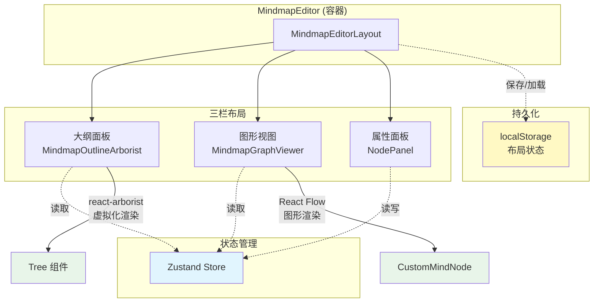

# 思维导图编辑器布局设计

## 元信息

- 作者：Claude Code
- 创建日期：2025-10-19
- 最后更新：2025-10-19
- 相关文档：
  - [思维导图编辑器 Store 设计](./mindmap-editor-store-design.md)
  - [ID 设计规范](./id-design.md)

## 关键概念

> 本节定义该设计文档引入的新概念，不包括外部库或其他文档已定义的概念。

| 概念             | 定义                                                   | 示例/说明                                        |
| ---------------- | ------------------------------------------------------ | ------------------------------------------------ |
| 三栏布局         | 左中右三个区域的编辑器布局模式                         | 大纲视图 \| 图形视图 \| 属性面板                 |
| 可调整宽度面板   | 用户可通过拖拽边界调整面板宽度的交互模式               | 大纲面板宽度范围：180-400px                      |
| 虚拟化大纲视图   | 使用虚拟化技术渲染大量节点的树形列表视图               | 仅渲染可见节点，支持上千个节点流畅滚动           |
| 折叠节点高亮     | 当选中节点被折叠隐藏时，高亮显示包含该节点的父节点按钮 | 蓝色高亮的 + 按钮，引导用户找到当前选中节点      |
| 动态尺寸测量     | 使用 ResizeObserver 实时监听容器尺寸变化               | 确保 Tree 组件在面板调整时自动适应新尺寸         |
| 布局状态持久化   | 将用户的布局偏好保存到 localStorage                    | 面板折叠状态、宽度设置在刷新后保持               |
| 双视图同步       | 大纲视图和图形视图共享同一状态，保持数据一致           | 在大纲中选中节点，图形视图自动滚动到对应节点位置 |
| 性能优化组件包装 | 使用 React.memo 包装组件避免不必要的重渲染             | 只有直接依赖的 props 变化时才重新渲染组件        |

**原则**：

- 仅包含本文档新设计/引入的概念
- 外部库概念（如 Zustand、React Flow、react-arborist）不应包含
- 其他设计文档已定义的概念（如 Store、short_id）应引用原文档
- 定义应聚焦于本设计的独特贡献

## 概述

思维导图编辑器布局设计定义了一个三栏式的编辑器界面，提供大纲视图、图形视图、属性面板三个协作区域，通过统一的状态管理和高效的渲染策略，实现流畅的大规模思维导图编辑体验。

## 背景和动机

### 问题

1. **多视图需求**：用户需要同时查看思维导图的树形结构（大纲）和图形表示
2. **狭窄空间优化**：传统大纲视图在狭窄面板中显示效果差，需要虚拟化支持
3. **用户个性化**：不同用户对面板宽度和显示偏好不同
4. **导航困难**：在大型思维导图中，折叠节点后用户容易迷失当前位置
5. **性能挑战**：大量节点的同时渲染会导致性能问题

### 为什么需要这个设计

- **提升效率**：通过多视图协作，用户可以快速在不同层次间切换
- **优化体验**：可调整布局和虚拟化渲染提供流畅的使用体验
- **降低认知负担**：折叠节点高亮和自动滚动帮助用户保持空间方向感
- **支持规模化**：虚拟化技术支持上千节点的思维导图流畅编辑

## 设计目标

- **高性能**：支持 1000+ 节点的流畅渲染和交互
- **响应式**：布局自适应窗口大小和用户调整
- **直观导航**：提供清晰的视觉反馈，帮助用户定位和导航
- **个性化**：支持用户自定义布局偏好并持久化
- **双向同步**：大纲视图和图形视图数据实时同步

## 设计方案

### 架构概览



**数据流**：

```
用户操作 → 组件 → Store 更新 → 所有订阅组件重渲染 → UI 更新
                    ↓
              localStorage (布局状态)
```

### 详细设计

#### 组件层次结构

```
MindmapEditor (初始化 Store)
└── MindmapEditorLayout (布局管理)
    ├── MindmapOutlineArborist (大纲视图)
    │   ├── 标题栏 (展开/折叠控制)
    │   └── Tree 容器
    │       └── react-arborist Tree
    │           └── Node (节点渲染器)
    ├── MindmapGraphViewer (图形视图)
    │   └── ReactFlowProvider
    │       └── ReactFlow
    │           └── CustomMindNode (节点组件)
    └── NodePanel (属性编辑)
```

#### 布局管理机制

**MindmapEditorLayout** 职责：

1. **三栏布局管理**：使用 Flexbox 实现响应式三栏布局
2. **宽度调整**：监听鼠标事件实现拖拽调整大纲面板宽度（180-400px）
3. **折叠控制**：管理大纲面板的展开/折叠状态
4. **状态持久化**：将布局偏好保存到 localStorage

**关键实现要点**：

- 使用 `useCallback` 优化事件处理函数
- 通过 `isResizing` 状态控制拖拽时的样式和行为
- 双击调整手柄恢复默认宽度（280px）
- 拖拽时设置 `userSelect: none` 防止文本选中

#### 大纲视图实现

**MindmapOutlineArborist** 职责：

1. **数据转换**：将 Store 中的 Map<string, MindmapNode> 转换为 Tree 数据结构
2. **虚拟化渲染**：使用 react-arborist 实现高性能虚拟化列表
3. **动态尺寸**：使用 ResizeObserver 测量容器尺寸，传递给 Tree 组件
4. **自动滚动**：当 currentNode 变化时，自动滚动到对应节点

**技术选型理由**：

- **react-arborist vs 自定义实现**：
  - react-arborist 提供成熟的虚拟化和拖拽排序功能
  - 减少维护成本，专注业务逻辑
  - 支持大量节点（1000+）的流畅渲染

**关键实现要点**：

- `convertToTreeData`：递归转换数据，按 `order_index` 排序子节点
- ResizeObserver 监听容器尺寸变化，更新 `containerHeight` 状态
- Tree 组件要求 `width` 和 `height` 为 `number` 类型（像素值）
- 使用 `containerHeight > 0` 条件渲染，确保尺寸已计算

**数据转换流程**：

```
Store.nodes (Map) → convertToTreeData → TreeNode[] → react-arborist
```

#### 图形视图实现

**MindmapGraphViewer** 职责：

1. **图形布局**：使用 Dagre 算法计算节点位置
2. **节点渲染**：使用 React Flow 渲染节点和连线
3. **交互处理**：节点拖拽、选中、展开/折叠
4. **自动布局**：节点变化时自动重新计算布局

**CustomMindNode** 特性：

1. **折叠节点高亮**：检测当前选中节点是否在折叠子树中，高亮显示 + 按钮
2. **视觉反馈**：选中状态、根节点、折叠状态的不同样式
3. **+/- 按钮**：位于节点右侧连接点位置，控制子节点展开/折叠

**折叠节点高亮算法**：

```typescript
// 检查 targetNode 是否在 parentNode 的子树中
function isNodeInSubtree(targetNodeId, parentNodeId, nodesMap) {
  let currentId = targetNodeId;
  while (currentId) {
    if (currentId === parentNodeId) return true;
    currentId = nodesMap.get(currentId)?.parent_short_id;
  }
  return false;
}
```

**时间复杂度**：O(h)，h 为树的高度

#### 属性面板实现

**NodePanel** 职责：

1. **节点属性编辑**：标题、描述、图标、颜色等
2. **实时更新**：编辑时直接更新 Store，触发其他视图同步更新
3. **右侧固定**：固定宽度 320px，不可调整

#### 状态管理

**数据来源**：所有组件从 `useMindmapEditorStore` 读取数据

```typescript
const {
  currentMindmap, // 当前思维导图
  currentNode, // 当前选中节点 ID
  nodes, // Map<string, MindmapNode>
  collapsedNodes, // Set<string> 折叠的节点 ID
  getRootNode, // 获取根节点
  setCurrentNode, // 设置选中节点
} = useMindmapEditorStore();
```

**更新机制**：

- 使用 Zustand 的 `setState` 更新状态
- 使用 Immer 中间件保证不可变更新
- 所有订阅组件自动重新渲染

#### 性能优化策略

1. **组件 Memo 化**：
   - MindmapOutlineArborist, MindmapGraphViewer, NodePanel 使用 `React.memo`
   - 只有直接依赖的 props 变化时才重渲染

2. **虚拟化渲染**：
   - 大纲视图使用 react-arborist 虚拟化
   - 只渲染可见区域的节点

3. **选择器优化**：
   - 使用 Zustand 的选择器订阅特定状态
   - 避免订阅整个 Store 导致的过度渲染

4. **事件处理优化**：
   - 使用 `useCallback` 缓存回调函数
   - 使用 `useMemo` 缓存计算结果

## 实现要点

### 1. ResizeObserver 使用

**作用**：监听容器尺寸变化，动态更新 Tree 组件的宽高

**实现模式**：

```typescript
const [containerHeight, setContainerHeight] = useState<number>(0);

useEffect(() => {
  if (!containerRef.current) return;

  const resizeObserver = new ResizeObserver((entries) => {
    for (const entry of entries) {
      setContainerHeight(entry.contentRect.height);
    }
  });

  resizeObserver.observe(containerRef.current);
  return () => resizeObserver.disconnect();
}, []);
```

**关键点**：

- 使用 `entry.contentRect` 获取内容区域尺寸（不包括边框和滚动条）
- 必须在 cleanup 函数中调用 `disconnect()`
- `containerHeight > 0` 条件渲染确保尺寸已计算

### 2. 高度链条

确保容器高度正确传递到 Tree 组件：

```
MindmapEditorLayout (h-full)
  → outline-panel (h-full)
    → MindmapOutlineArborist (h-full flex flex-col)
      → Tree 容器 (flex-1 min-h-0)
        → ResizeObserver 测量
          → Tree (height={containerHeight})
```

**`min-h-0` 的作用**：允许 flex 子元素缩小，避免内容溢出

### 3. localStorage 持久化

**保存时机**：`useEffect` 监听状态变化时自动保存

```typescript
useEffect(() => {
  saveLayoutState({
    isOutlineCollapsed,
    outlineWidth,
  });
}, [isOutlineCollapsed, outlineWidth]);
```

**加载时机**：组件初始化时从 localStorage 加载

### 4. 拖拽调整宽度

**实现步骤**：

1. `onMouseDown` → 设置 `isResizing = true`
2. `onMouseMove` → 更新 `outlineWidth`（带范围限制）
3. `onMouseUp` → 设置 `isResizing = false`
4. 全局事件监听（document.addEventListener）

**优化细节**：

- 拖拽时设置 `body.style.userSelect = "none"` 和 `cursor = "col-resize"`
- 非拖拽时添加 `transition-all duration-200` 实现平滑动画

### 5. 自动滚动到当前节点

**大纲视图**：

```typescript
useEffect(() => {
  if (!currentNode || isCollapsed || !treeRef.current) return;

  setTimeout(() => {
    treeRef.current?.focus(currentNode, { scroll: true });
  }, 100);
}, [currentNode, isCollapsed]);
```

**图形视图**：使用 React Flow 的 `fitView` 或 `setCenter` API

## 使用示例

### 布局状态管理示例

```typescript
// 在 MindmapEditorLayout 中
const [isOutlineCollapsed, setIsOutlineCollapsed] = useState(true);
const [outlineWidth, setOutlineWidth] = useState(280);

// 切换折叠状态
<MindmapOutlineArborist
  isCollapsed={isOutlineCollapsed}
  onToggleCollapse={() => setIsOutlineCollapsed(!isOutlineCollapsed)}
/>
```

### Store 数据订阅示例

```typescript
// 在组件中订阅特定状态
const { currentNode, setCurrentNode } = useMindmapEditorStore();

// 点击节点时更新选中状态
const handleClick = () => {
  setCurrentNode(node.data.id);
};
```

### 折叠节点高亮示例

```typescript
// 计算是否包含当前选中节点
const containsCurrentNode =
  !isExpanded &&
  currentNode &&
  currentNode !== nodeData.shortId &&
  isNodeInSubtree(currentNode, nodeData.shortId, nodes);

// 应用高亮样式
<button
  className={cn({
    "bg-blue-500 text-white shadow-md": containsCurrentNode,
    "bg-white border-gray-400": !containsCurrentNode,
  })}
>
  {isExpanded ? "−" : "+"}
</button>
```

## 设计决策

### 1. 为什么选择三栏布局？

**原因**：

- **符合用户心智模型**：左侧导航、中间主内容、右侧属性是常见的编辑器模式
- **最大化信息密度**：同时展示结构、图形、详情，减少视图切换
- **支持不同工作流**：用户可根据需求聚焦不同区域

**替代方案**：

- ❌ 标签页切换：需要频繁切换，打断工作流
- ❌ 上下分屏：垂直空间不足，图形视图受限

### 2. 为什么使用 react-arborist？

**原因**：

- **成熟的虚拟化**：支持大量节点（1000+）流畅渲染
- **开箱即用**：提供展开/折叠、拖拽排序等功能
- **类型安全**：完整的 TypeScript 支持
- **活跃维护**：社区活跃，bug 修复及时

**替代方案**：

- ❌ 自定义实现：开发成本高，维护困难
- ❌ react-window：功能较基础，需要自己实现树形结构
- ❌ rc-tree：虚拟化支持不完善

### 3. 为什么使用 ResizeObserver？

**原因**：

- **原生 API**：无需第三方库，性能优秀
- **自动响应**：容器尺寸变化时自动触发
- **浏览器优化**：内置去抖动，不会过度触发

**替代方案**：

- ❌ window.resize 事件：无法监听元素尺寸变化
- ❌ react-resize-detector：增加依赖，性能不如原生
- ❌ CSS 百分比：react-arborist 要求数值型 width/height

### 4. 为什么左侧面板可折叠和调整宽度？

**原因**：

- **空间优化**：小屏幕时可折叠大纲，留更多空间给图形视图
- **个性化**：不同用户对大纲宽度偏好不同
- **渐进式披露**：默认折叠，需要时再展开

### 5. 为什么使用 localStorage 而不是云端同步？

**原因**：

- **快速响应**：本地读写无延迟
- **隐私保护**：布局偏好是个人设置，无需上传
- **离线可用**：无网络时仍可加载布局
- **降低复杂度**：避免同步冲突

### 6. 为什么折叠节点要高亮 + 按钮？

**原因**：

- **导航需求**：用户折叠节点后容易迷失当前位置
- **视觉引导**：蓝色高亮立即吸引注意力，指示选中节点位置
- **降低认知负担**：无需手动展开多层节点查找

## FAQ

### Q1: 大纲视图和图形视图如何保持同步？

A: 两个视图共享同一个 Zustand Store，任何一个视图的操作都会更新 Store，触发另一个视图重新渲染。

### Q2: 如何支持上千个节点的流畅渲染？

A:

- 大纲视图使用 react-arborist 虚拟化，只渲染可见节点
- 图形视图使用 React Flow 优化，支持大规模节点
- 组件使用 React.memo 避免不必要的重渲染

### Q3: 用户调整面板宽度后刷新页面会丢失吗？

A: 不会。布局状态保存在 localStorage，页面刷新后自动加载用户的布局偏好。

### Q4: 为什么 Tree 组件需要数值型的 width/height？

A: react-arborist 内部使用虚拟化计算，需要精确的像素尺寸来确定可见区域和滚动位置。字符串（如 "100%"）无法满足这一要求。

### Q5: 折叠节点高亮如何处理多层嵌套？

A: `isNodeInSubtree` 函数会沿着父节点链向上遍历，只要当前节点在遍历路径中，就会返回 true。因此多层嵌套时，最近的折叠父节点会被高亮。

## 参考资料

### 外部库

- [react-arborist](https://github.com/brimdata/react-arborist) - 虚拟化树组件
- [React Flow](https://reactflow.dev/) - 图形渲染库
- [Zustand](https://github.com/pmndrs/zustand) - 状态管理
- [ResizeObserver MDN](https://developer.mozilla.org/en-US/docs/Web/API/ResizeObserver) - 尺寸监听 API

### 相关设计文档

- [思维导图编辑器 Store 设计](./mindmap-editor-store-design.md) - 状态管理架构
- [ID 设计规范](./id-design.md) - 节点 ID 生成规则

### 实现记录

- `.claude/logs/tree-size-fix.md` - Tree 组件尺寸修复过程
- `.claude/logs/collapsed-node-highlight-feature.md` - 折叠节点高亮功能实现
- `.claude/logs/ui-icon-improvements.md` - UI 图标改进记录

## 修订历史

| 日期       | 版本 | 修改内容     | 作者        |
| ---------- | ---- | ------------ | ----------- |
| 2025-10-19 | 1.0  | 初始版本创建 | Claude Code |
