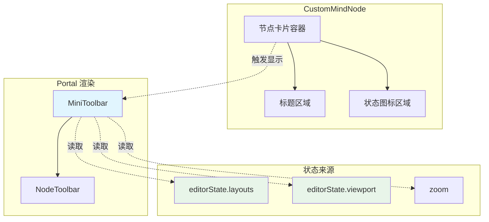

# 思维导图节点卡片设计

## 元信息

- 作者：Claude Code
- 创建日期：2025-11-23
- 最后更新：2025-11-23
- 相关文档：
  - [编辑器 UI 布局设计](./editor-ui-layout-design.md)
  - [视口管理设计](./viewport-management-design.md)
  - [Command 层架构设计](./command-layer-design.md)

## 关键概念

> 本节定义该设计文档引入的新概念，不包括外部库或其他文档已定义的概念。

| 概念                      | 定义                                                 | 示例/说明                          |
| ------------------------- | ---------------------------------------------------- | ---------------------------------- |
| 迷你工具栏（MiniToolbar） | 嵌入节点卡片左上角的缩小版工具栏，hover 时放大       | 提供 AI 助手、添加节点、删除等操作 |
| 状态图标区域              | 节点卡片右下角的图标显示区，展示节点附加状态         | Note 图标表示节点有笔记内容        |
| Portal 定位               | 使用 React Portal 将工具栏渲染到 React Flow 容器顶层 | 避免被其他节点遮挡                 |

**原则**：

- 仅包含本文档新设计/引入的概念
- 外部库概念（如 React Flow、Portal）不应包含
- 其他设计文档已定义的概念应引用原文档

## 概述

思维导图节点卡片设计定义了节点的视觉布局和交互行为，包括三个核心区域：迷你工具栏区域、标题区域、状态图标区域。通过 Portal 和坐标转换实现工具栏的层级管理和缩放交互。

## 背景和动机

### 问题

1. **工具栏遮挡**：原有浮动工具栏在节点上方，视觉上与节点分离
2. **操作便捷性**：缩放比例较小时，工具栏按钮难以点击
3. **状态展示**：节点的附加状态（如笔记、AI 对话）需要快速识别
4. **层级问题**：工具栏放大后可能被其他节点遮挡

### 为什么需要这个设计

- **提升操作效率**：工具栏嵌入节点，减少鼠标移动距离
- **自适应缩放**：hover 时工具栏放大到可操作尺寸
- **状态可见性**：通过图标快速了解节点状态
- **层级管理**：Portal 确保工具栏始终在最上层

## 设计目标

- 工具栏与节点视觉融合，但不干扰正常浏览
- 支持任意缩放比例下的便捷操作
- 状态图标区域稳定占位，不影响卡片尺寸
- 工具栏放大时不被其他节点遮挡

## 设计方案

### 架构概览

```
CustomMindNode (节点卡片)
├── MiniToolbar (迷你工具栏 - Portal 渲染)
│   └── NodeToolbar (命令按钮组)
├── 标题区域
└── 状态图标区域
    └── Note 图标 (条件显示)
```

### 节点卡片布局

```
┌──────────────────────────────────────┐
│ [迷你工具栏] ← 顶部 padding 区域     │
├──────────────────────────────────────┤
│                                      │
│            节点标题                   │
│                                      │
├──────────────────────────────────────┤
│                         [状态图标]   │  ← 16px 固定高度
└──────────────────────────────────────┘
```

### 详细设计

#### 1. CustomMindNode 组件

**文件**：`src/components/mindmap/viewer/custom-mind-node.tsx`

**布局样式**：

```tsx
className={cn(
  "mind-node relative",
  "flex flex-col",
  "min-w-[150px] pt-6 px-4 pb-1",
  // ... 选中状态、根节点样式
)}
```

**显示逻辑**：

- hover 状态通过 `useState` 追踪
- 工具栏在 `isSelected || isHovered` 时显示

#### 2. MiniToolbar 组件

**文件**：`src/components/mindmap/viewer/mini-toolbar.tsx`

**核心实现**：

1. **始终使用 Portal**：渲染到 `.react-flow` 容器顶层
2. **坐标转换**：通过 `editorState.layouts` 和 `viewport` 计算屏幕位置
3. **缩放控制**：非 hover 时缩小，hover 时至少为标准尺寸

**缩放公式**：

```typescript
const baseScale = 1 / 1.8;
const scale = isHovered
  ? Math.max(1, zoom * baseScale) // hover: 至少标准尺寸
  : baseScale * zoom; // 非 hover: 随画布缩放
```

**坐标转换**：

工具栏位置基于节点坐标系计算，需转换为屏幕坐标进行Portal定位。转换公式：

```typescript
function nodeToScreenCoords(nodeX, nodeY, viewport) {
  return {
    screenX: (nodeX - viewport.x) * viewport.zoom,
    screenY: (nodeY - viewport.y) * viewport.zoom,
  };
}
```

**坐标系统详解**: 参见 [视口管理设计 - 坐标系转换](./viewport-management-design.md#坐标系转换公式)，包含节点坐标系与屏幕坐标系的完整说明。

#### 3. 状态图标区域

- 位置：卡片内部右下角
- 高度：16px 固定
- 始终占位：即使无图标显示也保留空间
- 当前支持：Note 图标（14px × 14px）

### 组件关系图



## 实现要点

### 1. Portal 定位计算

工具栏位置基于节点在画布中的位置计算：

```typescript
const layout = editorState.layouts.get(node.short_id);
const { viewport } = editorState;

// 工具栏底部对齐位置（节点坐标系）
const toolbarBottomInNodeCoords = layout.y + toolbarBaseHeight * baseScale;
const toolbarLeftInNodeCoords = layout.x + 4;

// 转换为屏幕坐标
const { screenX, screenY } = nodeToScreenCoords(
  toolbarLeftInNodeCoords,
  toolbarBottomInNodeCoords,
  viewport
);
```

### 2. z-index 层级

Portal 渲染时使用 `zIndex: 10000`，确保高于所有节点。

### 3. 过渡动画

```tsx
className = "transition-all duration-150";
```

### 4. hover 状态管理

工具栏自身管理 hover 状态，而非依赖节点的 hover：

```tsx
onMouseEnter={() => setIsHovered(true)}
onMouseLeave={() => setIsHovered(false)}
```

## 设计决策

### 1. 为什么使用 Portal？

**原因**：

- React Flow 中每个节点是独立的 stacking context
- 节点内部的 z-index 无法影响其他节点
- Portal 将工具栏渲染到顶层容器，脱离节点的层级限制

**替代方案**：

- ❌ 提升节点 z-index：无法解决跨 stacking context 问题
- ❌ 使用 React Flow 的 NodeToolbar：位置在节点外部，与设计不符

### 2. 为什么基于 layouts 和 viewport 计算位置？

**原因**：

- `getBoundingClientRect()` 返回的是 DOM 元素的屏幕位置
- 但 Portal 需要相对于 React Flow 容器定位
- 使用 layouts（节点坐标系）+ viewport 转换更精确

### 3. 为什么状态图标区域始终占位？

**原因**：

- 避免卡片尺寸因状态变化而跳动
- 保持布局稳定，减少视觉干扰
- 为未来扩展预留空间

## FAQ

### Q1: 工具栏放大后位置偏移怎么处理？

A: 使用 `transform-origin: bottom left`，确保放大时底部左角位置不变，向上和向右扩展。

### Q2: 状态图标区域未来如何扩展？

A: 状态图标区域使用 flex 布局，新增图标只需在条件渲染中添加即可：

```tsx
<div className="h-4 flex justify-end items-center gap-1">
  {node?.note && <AlignLeft ... />}
  {/* 未来: AI 对话图标、任务状态图标等 */}
</div>
```

### Q3: 缩放比例很小时工具栏还能使用吗？

A: 是的。hover 时工具栏会放大到至少标准尺寸（scale >= 1），确保可点击性。

## 参考资料

- [React Portal 文档](https://react.dev/reference/react-dom/createPortal)
- [视口管理设计](./viewport-management-design.md) - 坐标系转换说明

## 修订历史

| 日期       | 版本 | 修改内容     | 作者        |
| ---------- | ---- | ------------ | ----------- |
| 2025-11-23 | 1.0  | 初始版本创建 | Claude Code |
