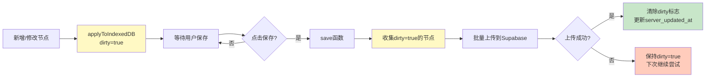

# 持久化中间件设计

## 元信息

- 创建日期: 2025-11-24
- 最后更新: 2025-11-24
- 作者: Claude Code
- 状态: 正式版本
- 相关文档:
  - [领域层架构设计](./domain-layer-architecture.md)
  - [数据库设计](./database-schema.md)
  - [MindmapStore 架构设计](./mindmap-store-design.md)
  - [Action 层架构设计](./action-layer-design.md)

## 关键概念

| 概念             | 定义                                                       | 示例/说明                                 |
| ---------------- | ---------------------------------------------------------- | ----------------------------------------- |
| 三层存储架构     | 内存（EditorState） → 本地（IndexedDB） → 云端（Supabase） | 分层持久化，提供离线支持和多设备同步      |
| Dirty Flag       | 标记数据是否有未保存到服务器的修改                         | `dirty: true` 表示需要同步                |
| 增量同步         | 只上传标记为 dirty 的数据，而非全量上传                    | 减少网络传输，提升同步效率                |
| 冲突检测         | 基于时间戳比较，检测本地和服务器数据是否冲突               | `local_updated_at` vs `server_updated_at` |
| 版本号           | EditorState.version，每次 acceptActions 递增               | 用于追踪状态变更，调试和日志              |
| applyToIndexedDB | Action 的持久化方法，将变更写入 IndexedDB                  | 异步执行，不阻塞 UI 响应                  |
| 持久化中间件     | 在 Action 执行后自动触发 IndexedDB 更新的机制              | 集成在 acceptActions 流程中               |

## 概述

持久化中间件负责将内存状态同步到 IndexedDB 和 Supabase，实现三层存储架构。通过 Dirty Flag 机制追踪变更，支持增量同步和冲突检测，保证数据一致性和离线可用性。

## 设计目标

1. **离线优先**: 本地操作立即响应，无需网络连接
2. **增量同步**: 只上传变更数据，减少网络传输
3. **冲突感知**: 基于时间戳检测并提示冲突
4. **数据安全**: IndexedDB 事务保证本地数据一致性
5. **性能优化**: 异步持久化，不阻塞 UI 响应

---

## 三层存储架构

### 架构概览

```
┌──────────────────────────────────────────────┐
│   EditorState (内存 - Zustand + Immer)       │
│   - 立即响应用户操作                         │
│   - Map/Set 优化查询性能                     │
│   - 会话级生命周期（关闭标签页即消失）       │
│   - 不持久化 UI 状态（viewport等）           │
└──────────────────┬───────────────────────────┘
                   │ acceptActions()
                   │ → 调用 applyToIndexedDB()
                   ↓
┌──────────────────────────────────────────────┐
│   IndexedDB (本地数据库 - idb)               │
│   - 数据安全（不会因刷新而丢失）             │
│   - 离线支持（无网络也可用）                 │
│   - dirty 标志追踪变更                       │
│   - 快速启动（本地加载优先）                 │
└──────────────────┬───────────────────────────┘
                   │ save()
                   │ → 收集 dirty=true 数据
                   ↓
┌──────────────────────────────────────────────┐
│   Supabase (服务器数据库 - PostgreSQL)       │
│   - 云端存储（永久保存）                     │
│   - 多设备同步（跨浏览器/设备访问）          │
│   - 协作基础（未来扩展）                     │
│   - 权限控制（RLS策略）                      │
└──────────────────────────────────────────────┘
```

### 数据流方向

**写入流程（用户操作 → 服务器）**:

```
用户操作 → Command → Action
  → acceptActions() [内存更新]
  → applyToIndexedDB() [本地持久化, dirty=true]
  → save() [按需同步到服务器, dirty=false]
```

**读取流程（应用启动）**:

```
initializeEditor()
  → 从 IndexedDB 加载数据
  → 构建 EditorState (Map/Set)
  → 渲染 UI
  → 后台检查服务器更新（可选）
```

### 设计决策

**为什么需要三层？**

| 存储层    | 优点                  | 缺点                   | 适用场景           |
| --------- | --------------------- | ---------------------- | ------------------ |
| 内存      | 极快（微秒级）        | 刷新即丢失             | 即时响应用户操作   |
| IndexedDB | 快（毫秒级）+ 持久    | 单设备，无法跨设备同步 | 离线支持，快速启动 |
| Supabase  | 多设备同步 + 云端备份 | 较慢（秒级）+ 需要网络 | 跨设备访问，协作   |

**为什么不直接写 Supabase？**

- ❌ 网络延迟导致操作卡顿（每次操作等待几百毫秒）
- ❌ 离线时无法使用
- ❌ 频繁网络请求浪费带宽

**为什么不只用 IndexedDB？**

- ❌ 无法跨设备访问
- ❌ 浏览器数据可能被清理
- ❌ 没有云端备份

---

## Dirty Flag 机制

### 工作原理

**核心思想**: 追踪哪些数据需要同步到服务器

```typescript
interface MindmapNodeWithMeta extends MindmapNode {
  dirty: boolean; // 是否有未上传的修改
  local_updated_at: string; // 本地最后修改时间
  server_updated_at: string; // 服务器最后同步时间
}
```

### 生命周期



### 实现代码

**Action 中的持久化方法**:

```typescript
class AddNodeAction implements EditorAction {
  async applyToIndexedDB() {
    const db = await getDB();

    await db.put("mindmap_nodes", {
      ...this.node,
      dirty: true, // 标记为需要同步
      local_updated_at: new Date().toISOString(),
    });
  }
}
```

**Store 的保存方法**:

```typescript
async save() {
  const db = await getDB();

  // 1. 收集所有 dirty 节点
  const allNodes = await db.getAll("mindmap_nodes");
  const dirtyNodes = allNodes.filter(n => n.dirty);

  if (dirtyNodes.length === 0) {
    console.log("没有需要同步的数据");
    return;
  }

  // 2. 冲突检测（可选）
  // ...

  // 3. 上传到 Supabase
  const { error } = await supabase
    .from("mindmap_nodes")
    .upsert(dirtyNodes.map(n => ({
      ...n,
      updated_at: new Date().toISOString()
    })));

  if (error) throw error;

  // 4. 清除 dirty 标志
  for (const node of dirtyNodes) {
    await db.put("mindmap_nodes", {
      ...node,
      dirty: false,
      server_updated_at: new Date().toISOString()
    });
  }

  console.log(`成功同步 ${dirtyNodes.length} 个节点`);
}
```

### 优势

- ✅ **增量同步**: 只上传变更数据，节省带宽
- ✅ **容错性**: 上传失败时 dirty 标志保留，下次继续尝试
- ✅ **可见性**: 用户可以看到"未保存"状态
- ✅ **批量优化**: 多个变更可以一次性上传

---

## 版本管理

### 三个时间戳/版本号

| 字段                  | 位置      | 类型    | 用途                       |
| --------------------- | --------- | ------- | -------------------------- |
| `EditorState.version` | 内存      | number  | 追踪内存状态变更次数       |
| `local_updated_at`    | IndexedDB | ISO时间 | 记录本地最后修改时间       |
| `server_updated_at`   | IndexedDB | ISO时间 | 记录服务器最后同步时间     |
| `updated_at`          | Supabase  | ISO时间 | 服务器端记录的最后修改时间 |

### 版本号递增规则

```typescript
// EditorState.version - 内存版本号
acceptActions(actions) {
  // 1. 应用 actions 到内存
  set(
    produce((draft) => {
      actions.forEach(action => action.applyToEditorState(draft));
      draft.version++;  // 每次 acceptActions 递增
    })
  );

  // 2. 持久化到 IndexedDB
  await Promise.all(actions.map(a => a.applyToIndexedDB()));
}
```

### 冲突检测策略

**场景**: 用户在多个设备上编辑同一思维导图

**检测逻辑**:

```typescript
async save() {
  const localNodes = await getLocalDirtyNodes();

  for (const localNode of localNodes) {
    // 1. 获取服务器最新数据
    const serverNode = await supabase
      .from("mindmap_nodes")
      .select()
      .eq("id", localNode.id)
      .single();

    // 2. 比较时间戳
    if (serverNode &&
        new Date(localNode.server_updated_at) < new Date(serverNode.updated_at)) {
      // 服务器有更新的数据，存在冲突
      throw new ConflictError({
        message: "服务器数据已被其他设备修改",
        localNode,
        serverNode
      });
    }
  }

  // 3. 无冲突，执行上传
  await uploadNodes(localNodes);
}
```

**冲突解决策略**（需要用户选择）:

1. **保留本地**: 强制覆盖服务器数据
2. **保留服务器**: 丢弃本地修改，重新加载
3. **取消保存**: 不做任何操作

---

## 持久化中间件集成

### 在 acceptActions 中的位置

```typescript
acceptActions(actions: EditorAction[]) {
  // 阶段1: 更新内存（同步）
  set(
    produce((draft) => {
      actions.forEach(action => {
        action.applyToEditorState(draft);  // Immer 不可变更新
      });
      draft.version++;
      draft.isSaved = false;  // 标记为未保存
    })
  );

  // 阶段2: 持久化到 IndexedDB（异步，不阻塞）
  Promise.all(
    actions.map(action => action.applyToIndexedDB?.())
  ).catch(error => {
    console.error("持久化到 IndexedDB 失败:", error);
    // 注意：内存已更新，但 IndexedDB 失败
    // 可以提示用户"本地保存失败，数据可能丢失"
  });
}
```

### 错误处理

**IndexedDB 写入失败的情况**:

```typescript
// 示例：磁盘空间不足
try {
  await db.put("mindmap_nodes", node);
} catch (error) {
  if (error.name === "QuotaExceededError") {
    // 提示用户清理浏览器缓存或删除旧数据
    alert("存储空间不足，请清理浏览器缓存");
  }
}
```

**Supabase 上传失败的情况**:

```typescript
async save() {
  try {
    await uploadToSupabase();
  } catch (error) {
    if (error.code === "PGRST116") {
      // Row Level Security 拒绝
      alert("没有权限保存此思维导图");
    } else if (error.message.includes("network")) {
      // 网络错误
      alert("网络连接失败，请检查网络后重试");
    }
    // dirty 标志保留，用户可以稍后重试
  }
}
```

---

## 性能优化

### 1. 批量事务

**问题**: 每个 Action 独立写 IndexedDB 导致性能差

```typescript
// ❌ 差的做法：串行写入
for (const action of actions) {
  await action.applyToIndexedDB(); // 每次都开启新事务
}
```

**优化**: 使用 IndexedDB 事务

```typescript
// ✅ 好的做法：批量事务
async applyActionsToIndexedDB(actions: EditorAction[]) {
  const db = await getDB();
  const tx = db.transaction(["mindmap_nodes", "mindmaps"], "readwrite");

  await Promise.all([
    ...actions.map(a => a.applyToIndexedDB?.(tx)),
    tx.done  // 等待事务提交
  ]);
}
```

### 2. 防抖保存

**问题**: 用户频繁操作导致过多的保存请求

```typescript
// ❌ 每次操作都尝试保存
onChange={() => {
  store.save();  // 可能每秒触发多次
}}
```

**优化**: 使用防抖

```typescript
// ✅ 防抖保存（5秒内只保存一次）
const debouncedSave = debounce(() => store.save(), 5000);

onChange(() => {
  debouncedSave();
});
```

### 3. 后台同步

**策略**: 用户操作时不阻塞，空闲时自动同步

```typescript
// 应用启动时注册后台同步
setInterval(async () => {
  const dirtyCount = await getDirtyNodesCount();
  if (dirtyCount > 0) {
    console.log(`后台同步: 发现 ${dirtyCount} 个未保存节点`);
    await store.save();
  }
}, 60000); // 每分钟检查一次
```

---

## 最佳实践

### ✅ 推荐做法

1. **所有持久化 Action 都实现 applyToIndexedDB**

   ```typescript
   class UpdateNodeAction implements EditorAction {
     applyToEditorState(draft) {
       /* ... */
     }
     applyToIndexedDB() {
       /* ... */
     } // 必须实现
     reverse() {
       /* ... */
     }
   }
   ```

2. **使用事务保证一致性**

   ```typescript
   const tx = db.transaction(["nodes"], "readwrite");
   await node1.save(tx);
   await node2.save(tx);
   await tx.done; // 全部成功或全部失败
   ```

3. **优雅处理冲突**
   ```typescript
   try {
     await save();
   } catch (error) {
     if (error instanceof ConflictError) {
       // 提示用户选择解决方案
       showConflictDialog(error);
     }
   }
   ```

### ❌ 避免的做法

1. **不要在 Action.applyToEditorState 中访问 IndexedDB**

   ```typescript
   // ❌ 错误：在内存更新中访问数据库
   applyToEditorState(draft) {
     const node = await db.get("nodes", id);  // 异步操作阻塞
     draft.nodes.set(id, node);
   }
   ```

2. **不要同步执行 applyToIndexedDB**

   ```typescript
   // ❌ 错误：阻塞 UI
   acceptActions(actions) {
     actions.forEach(a => {
       a.applyToEditorState(draft);
       await a.applyToIndexedDB();  // 等待数据库写入
     });
   }
   ```

3. **不要忽略 dirty 标志**
   ```typescript
   // ❌ 错误：全量上传
   async save() {
     const allNodes = await db.getAll("nodes");
     await supabase.from("nodes").upsert(allNodes);  // 浪费带宽
   }
   ```

---

## 相关文档

- [数据库设计](./database-schema.md) - IndexedDB 和 Supabase Schema 定义
- [MindmapStore 架构设计](./mindmap-store-design.md) - Store 核心结构和 acceptActions 实现
- [Action 层架构设计](./action-layer-design.md) - Action 接口和 applyToIndexedDB 规范
- [领域层架构设计](./domain-layer-architecture.md) - 整体架构和数据流

---

## 修订历史

| 日期       | 版本 | 修改内容     | 作者        |
| ---------- | ---- | ------------ | ----------- |
| 2025-11-24 | 1.0  | 初始版本创建 | Claude Code |

---

_本文档从 mindmap-store-design.md 的"状态持久化"章节拆分而来，专注于持久化机制的设计和实现细节。_
