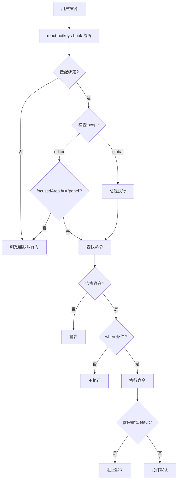

# 快捷键系统设计

## 元信息

- 作者：Claude Code
- 创建日期：2025-10-19
- 最后更新：2025-10-19
- 相关文档：
  - [命令系统设计](./command-system-design.md)
  - [思维导图编辑器 Store 设计](./mindmap-editor-store-design.md)

## 关键概念

| 概念                         | 定义                                           | 示例/说明                                     |
| ---------------------------- | ---------------------------------------------- | --------------------------------------------- |
| ShortcutBinding (快捷键绑定) | 将键盘组合映射到命令 ID 的配置对象             | `{ keys: 'tab', commandId: 'node.addChild' }` |
| FocusedArea (焦点区域)       | 应用中当前获得焦点的区域，决定快捷键的上下文   | `'graph'`, `'panel'`, `'outline'`, `'search'` |
| Scope (作用域)               | 快捷键的生效范围，分为编辑器作用域和全局作用域 | `'editor'` - 仅在编辑器中，`'global'` - 全局  |

## 概述

快捷键系统为思维导图编辑器提供上下文感知的键盘快捷键支持，通过集成 react-hotkeys-hook 库实现快捷键监听，并与命令系统配合实现业务逻辑。

## 背景和动机

### 问题

键盘快捷键是高效编辑的关键，但传统实现面临以下挑战：

1. **上下文冲突** - 同一快捷键在不同场景需要不同行为

   ```typescript
   // ❌ Enter 键在图形视图和编辑面板中应有不同行为
   // 图形视图: 添加兄弟节点
   // 编辑面板: 换行
   ```

2. **状态分散** - 快捷键启用状态散落在各个组件中
3. **难以维护** - 快捷键绑定硬编码在组件里
4. **测试困难** - 快捷键逻辑与 DOM 事件耦合

### 解决方案

引入上下文感知的快捷键系统：

```typescript
// ✅ 基于 focusedArea 状态决定快捷键行为
{
  keys: 'enter',
  commandId: 'node.addSiblingBelow',
  scope: 'editor',
  when: (ctx) => ctx.focusedArea !== 'panel',  // 仅在非编辑面板时生效
}
```

## 设计目标

1. **上下文感知** - 根据应用状态启用/禁用快捷键
2. **状态驱动** - 使用 Zustand Store 统一管理焦点状态
3. **预设方案** - 提供精心设计的默认快捷键集
4. **易于集成** - 基于成熟库快速实现
5. **原生体验保留** - 在编辑面板中使用浏览器原生快捷键

## 设计方案

### 架构概览

```
┌─────────────────────────────────────────┐
│       用户输入 (Keyboard Events)         │
└───────────────┬─────────────────────────┘
                │
                ▼
┌───────────────────────────────────────────┐
│    react-hotkeys-hook (监听层)            │
│  - 监听键盘事件                           │
│  - 匹配快捷键模式                         │
│  - 应用作用域规则                         │
└───────────────┬───────────────────────────┘
                │
                ▼
┌───────────────────────────────────────────┐
│    ShortcutBinding (绑定配置)             │
│  - keys: 'tab'                            │
│  - commandId: 'node.addChild'             │
│  - scope: 'editor'                        │
│  - preventDefault: true                   │
└───────────────┬───────────────────────────┘
                │
                ▼
┌───────────────────────────────────────────┐
│    上下文检查 (Context Check)             │
│  - 检查 focusedArea                       │
│  - 检查命令 when 条件                     │
│  - 决定是否执行命令                       │
└───────────────┬───────────────────────────┘
                │
                ▼
┌───────────────────────────────────────────┐
│    命令系统 (Command System)              │
│  - 查找命令                               │
│  - 执行 handler                           │
│  - 处理业务逻辑                           │
└───────────────────────────────────────────┘
```

### 详细设计

#### 数据模型

**ShortcutBinding 接口**:

```typescript
interface ShortcutBinding {
  keys: string; // 快捷键组合，如 'ctrl+s', 'tab'
  commandId: string; // 关联的命令 ID
  scope: "editor" | "global"; // 作用域
  preventDefault?: boolean; // 是否阻止默认行为
}
```

**FocusedArea 类型**:

```typescript
type FocusedArea = "graph" | "panel" | "outline" | "search";
```

#### 核心逻辑

**快捷键执行流程**:



**useShortcuts Hook 实现**:

```typescript
export function useShortcuts() {
  const store = useMindmapEditorStore();

  allBindings.forEach((binding) => {
    useHotkeys(
      binding.keys,
      (e) => {
        // 阻止默认行为
        if (binding.preventDefault) {
          e.preventDefault();
        }

        // 创建命令上下文
        const context = createCommandContext(store);

        // 检查作用域
        if (binding.scope === "editor" && context.focusedArea === "panel") {
          return; // 在编辑面板中不执行编辑器快捷键
        }

        // 执行命令
        commandRegistry.execute(binding.commandId, context);
      },
      {
        enabled: binding.scope === "global" || store.focusedArea !== "panel",
        enableOnFormTags: false, // 在表单元素中禁用
      },
      [store.focusedArea]
    );
  });
}
```

## 实现要点

### 1. 焦点区域管理

使用 Zustand Store 集中管理焦点状态：

```typescript
// lib/store/mindmap-editor.store.ts
interface MindmapEditorStore {
  focusedArea: FocusedArea;
  setFocusedArea: (area: FocusedArea) => void;
}
```

组件中更新焦点：

```typescript
// 图形视图获得焦点
onFocus={() => store.setFocusedArea('graph')}

// 编辑面板获得焦点
onFocus={() => store.setFocusedArea('panel')}
```

### 2. Panel 中的原生快捷键

在编辑面板（input/textarea）中，应使用浏览器原生快捷键：

```typescript
// ✅ 正确 - 编辑器快捷键不在 panel 中生效
{
  keys: 'ctrl+c',
  commandId: 'edit.copy',
  scope: 'editor',  // 仅在编辑器中
}

// 在 panel 中，用户可以正常使用 Ctrl+C 复制文本
```

实现方式：

1. **scope 检查**: `scope === 'editor'` 时检查 `focusedArea !== 'panel'`
2. **enableOnFormTags**: 设置为 `false`，在表单元素中禁用

### 3. 快捷键命名规范

使用 react-hotkeys-hook 的键名：

```typescript
// ✅ 正确
"tab"; // Tab 键
"enter"; // Enter 键
"ctrl+s"; // Ctrl+S (Windows/Linux)
"mod+s"; // Cmd+S (Mac) / Ctrl+S (Windows/Linux)
"mod+shift+z"; // Cmd+Shift+Z / Ctrl+Shift+Z
"arrowup"; // 上箭头
```

### 4. 作用域设计

**editor 作用域** - 仅在编辑器中生效：

- 节点操作快捷键
- 导航快捷键
- 大部分编辑快捷键

**global 作用域** - 全局生效：

- 保存 (Cmd+S)
- 可能的搜索快捷键

```typescript
// 保存命令应该全局可用
{
  keys: 'mod+s',
  commandId: 'global.save',
  scope: 'global',  // 在任何地方都可以保存
}
```

## 使用示例

### 定义快捷键绑定

```typescript
// lib/shortcuts/bindings/node.bindings.ts
export const nodeBindings: ShortcutBinding[] = [
  {
    keys: "tab",
    commandId: "node.addChild",
    scope: "editor",
    preventDefault: true,
  },
  {
    keys: "enter",
    commandId: "node.addSiblingBelow",
    scope: "editor",
    preventDefault: true,
  },
  {
    keys: "delete",
    commandId: "node.delete",
    scope: "editor",
    preventDefault: true,
  },
];
```

### 在应用中使用

```typescript
// components/mindmap-editor-container.tsx
export function MindmapEditorContainer() {
  // 激活快捷键系统
  useShortcuts();

  return (
    <div>
      <GraphViewer />
      <NodePanel />
    </div>
  );
}
```

### 更新焦点状态

```typescript
// components/node-panel.tsx
export function NodePanel() {
  const store = useMindmapEditorStore();

  return (
    <div
      onFocus={() => store.setFocusedArea('panel')}
      onBlur={() => store.setFocusedArea('graph')}
    >
      <input /* 这里可以使用原生快捷键 */ />
    </div>
  );
}
```

## 设计决策

### 1. 为什么选择 react-hotkeys-hook?

**考虑的方案**:

| 方案               | 优点                            | 缺点                    | 选择    |
| ------------------ | ------------------------------- | ----------------------- | ------- |
| react-hotkeys-hook | 轻量、Hook API、TypeScript 支持 | 功能相对简单            | ✅ 采用 |
| react-hotkeys      | 功能丰富、成熟稳定              | 基于 class，不支持 Hook | ❌      |
| 自研               | 完全控制                        | 开发成本高（7-10天）    | ❌      |

**决策理由**:

- 符合 React Hook 生态
- TypeScript 原生支持
- 轻量级（< 5KB）
- 社区活跃维护

### 2. 为什么使用 focusedArea 而不是 DOM focus?

**对比**:

```typescript
// 方案 A: focusedArea (采用)
scope === "editor" && focusedArea !== "panel";

// 方案 B: DOM focus
document.activeElement.tagName !== "INPUT";
```

**决策理由**:

- **状态驱动**: focusedArea 是 React 状态，可追踪、可测试
- **语义明确**: 'panel' 比 'INPUT' 更具业务含义
- **统一管理**: 所有状态在 Zustand Store 中
- **便于调试**: 可在 Redux DevTools 中查看

### 3. 为什么支持 preventDefault?

大部分快捷键需要阻止浏览器默认行为：

```typescript
// Tab 键默认会移动焦点，我们需要阻止这个行为
{
  keys: 'tab',
  commandId: 'node.addChild',
  preventDefault: true,  // ✅ 阻止焦点移动
}

// Ctrl+S 默认会保存网页，我们需要阻止
{
  keys: 'mod+s',
  commandId: 'global.save',
  preventDefault: true,  // ✅ 阻止浏览器保存
}
```

## 已实现快捷键概览

当前系统已实现 **21 个快捷键绑定**：

| 分类     | 数量 | 示例                                                       |
| -------- | ---- | ---------------------------------------------------------- |
| 节点操作 | 9    | Tab, Enter, Delete, F2, Cmd+D, Cmd+], Cmd+[, Cmd+Shift+↑/↓ |
| 导航     | 7    | ↑↓←→, Space, -, =                                          |
| 编辑     | 3    | Cmd+C/X/V                                                  |
| 全局     | 1    | Cmd+S                                                      |
| 待实现   | 8    | Cmd+Z, Cmd+F, Esc, 等                                      |

详细快捷键列表见 [快捷键参考手册](./shortcut-reference.md)（待创建）。

## 技术调研参考

### VSCode 快捷键系统

VSCode 的快捷键系统完全自研，采用 4 层架构：

```
KeybindingService    → 接收键盘事件
KeybindingsRegistry  → 注册快捷键规则
CommandsRegistry     → 注册命令
ContextKeyService    → 管理上下文（when 子句）
```

我们的设计借鉴了其核心思想：

- **上下文感知**: VSCode 的 `when` 子句 → 我们的 `focusedArea` 检查
- **命令分离**: 快捷键只是触发方式之一
- **JSON 配置**: VSCode 的配置文件 → 我们的 TypeScript 绑定数组

### Figma 快捷键系统

Figma 的特点：

- 支持 2500+ 种键盘布局
- 使用键盘位置码而非字符
- 150+ 快捷键

我们目前采用字符基础的快捷键（足够简单场景），未来如需国际化可考虑位置码方案。

## 参考资料

- [react-hotkeys-hook](https://react-hotkeys-hook.vercel.app/) - 使用的快捷键库
- [VSCode Keybindings](https://code.visualstudio.com/docs/getstarted/keybindings) - 最佳实践参考
- [Keyboard Event Reference](https://developer.mozilla.org/en-US/docs/Web/API/KeyboardEvent) - 键盘事件 API

## 修订历史

| 日期       | 版本 | 修改内容                 | 作者        |
| ---------- | ---- | ------------------------ | ----------- |
| 2025-10-19 | 1.0  | 初始版本，整理自草稿文档 | Claude Code |
