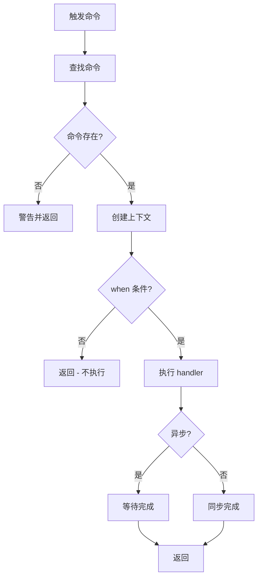

# 命令系统设计

## 元信息

- 作者：Claude Code
- 创建日期：2025-10-19
- 最后更新：2025-10-19
- 相关文档：
  - [快捷键系统设计](./shortcut-system-design.md)
  - [思维导图编辑器 Store 设计](./mindmap-editor-store-design.md)
  - [命令参考手册](./command-reference.md)

## 关键概念

| 概念                         | 定义                                                            | 示例/说明                              |
| ---------------------------- | --------------------------------------------------------------- | -------------------------------------- |
| Command (命令)               | 应用业务逻辑的最小执行单元，包含 ID、名称、处理函数和上下文条件 | `node.addChild` - 添加子节点命令       |
| CommandContext (命令上下文)  | 命令执行时可用的应用状态快照，包含 store 引用和派生状态         | 包含当前节点、焦点区域、选中状态等     |
| CommandRegistry (命令注册表) | 管理所有命令的注册、查找和执行的中央服务                        | 单例服务，存储 id → Command 映射       |
| When Condition (上下文条件)  | 决定命令是否可执行的布尔函数，基于当前上下文状态                | `(ctx) => ctx.focusedArea !== 'panel'` |

## 概述

命令系统为思维导图编辑器提供统一的业务逻辑执行入口，实现了触发方式与业务逻辑的解耦。任何 UI 组件（按钮、快捷键、菜单）都可以通过命令 ID 触发相同的业务逻辑。

## 背景和动机

### 问题

在传统的 React 应用中，业务逻辑通常直接写在事件处理函数中：

```typescript
// ❌ 业务逻辑与触发方式耦合
<button onClick={() => {
  const children = store.getChildren(node.short_id);
  const newNode = store.addChildNode({
    parentId: node.short_id,
    position: children.length,
    title: '新节点',
  });
  store.setCurrentNode(newNode.short_id);
}}>
  添加子节点
</button>
```

这导致：

1. **代码重复** - 同一逻辑在多处实现（工具栏、快捷键、右键菜单）
2. **难以测试** - 业务逻辑与 React 组件耦合
3. **缺乏统一性** - 快捷键和按钮可能实现不同的行为
4. **扩展困难** - 添加新触发方式需要重复实现逻辑

### 解决方案

引入命令系统，将业务逻辑抽象为独立的命令：

```typescript
// ✅ 业务逻辑与触发方式解耦
const command: Command = {
  id: "node.addChild",
  name: "添加子节点",
  handler: (ctx) => {
    const children = ctx.store.getChildren(ctx.selectedNode.short_id);
    const newNode = ctx.store.addChildNode({
      parentId: ctx.selectedNode.short_id,
      position: children.length,
      title: "新节点",
    });
    ctx.store.setCurrentNode(newNode.short_id);
  },
  when: (ctx) => ctx.focusedArea !== "panel",
};

// 任何地方都可以触发
commandRegistry.execute("node.addChild");
```

## 设计目标

1. **解耦触发与逻辑** - 快捷键、按钮、菜单都可以触发同一命令
2. **上下文感知** - 命令可根据应用状态决定是否可执行
3. **可扩展** - 易于添加新命令，无需修改现有代码
4. **可测试** - 命令逻辑独立，易于单元测试
5. **类型安全** - 完整的 TypeScript 类型定义

## 设计方案

### 架构概览

```
┌─────────────────────────────────────────┐
│          触发层 (Triggers)               │
│  ┌──────────┐ ┌──────────┐ ┌──────────┐ │
│  │ 快捷键   │ │  按钮    │ │  菜单    │ │
│  └──────────┘ └──────────┘ └──────────┘ │
└───────────────┬─────────────────────────┘
                │
                ▼
┌───────────────────────────────────────────┐
│      命令注册中心 (CommandRegistry)        │
│  - 注册/注销命令                          │
│  - 查找命令                               │
│  - 执行命令                               │
│  - 上下文验证                             │
└───────────────┬───────────────────────────┘
                │
                ▼
┌───────────────────────────────────────────┐
│         命令层 (Commands)                 │
│  ┌────────────┐  ┌────────────┐          │
│  │ 节点操作   │  │  导航操作  │          │
│  │ - addChild │  │ - select* │           │
│  │ - delete   │  │ - collapse │          │
│  └────────────┘  └────────────┘          │
│  ┌────────────┐  ┌────────────┐          │
│  │ 编辑操作   │  │  全局操作  │          │
│  │ - copy     │  │ - save     │          │
│  │ - paste    │  │ - undo     │          │
│  └────────────┘  └────────────┘          │
└───────────────┬───────────────────────────┘
                │
                ▼
┌───────────────────────────────────────────┐
│      业务逻辑层 (Business Logic)          │
│  - MindmapEditorStore (Zustand)           │
│  - 节点 CRUD 操作                         │
│  - 导航逻辑                               │
│  - 数据验证                               │
└───────────────────────────────────────────┘
```

### 详细设计

#### 数据模型

**Command 接口**:

```typescript
interface Command {
  // 基本信息
  id: string; // 唯一标识，如 'node.addChild'
  name: string; // 显示名称，如 '添加子节点'
  description: string; // 描述
  category: CommandCategory; // 命令分类

  // 执行逻辑
  handler: (context: CommandContext) => void | Promise<void>;

  // 上下文条件（可选）
  when?: (context: CommandContext) => boolean;

  // 元数据（可选）
  icon?: string; // 图标名称
  tags?: string[]; // 标签（用于搜索）
}

type CommandCategory = "node" | "navigation" | "edit" | "global" | "ai";
```

**CommandContext 接口**:

```typescript
interface CommandContext {
  // 核心状态
  store: MindmapEditorStore; // Zustand store 引用
  selectedNode: MindmapNode | null; // 当前选中节点
  focusedArea: FocusedArea; // 当前焦点区域

  // 派生状态（便捷访问）
  hasChildren: boolean; // 当前节点是否有子节点
  canDelete: boolean; // 是否可删除
  canCopy: boolean; // 是否可复制
  canPaste: boolean; // 是否可粘贴
}
```

#### 接口定义

**CommandRegistry 类**:

```typescript
class CommandRegistry {
  private commands: Map<string, Command> = new Map();

  // 注册命令
  register(command: Command): void;

  // 注销命令
  unregister(commandId: string): void;

  // 查找命令
  get(commandId: string): Command | undefined;

  // 检查命令是否可执行
  canExecute(commandId: string, context: CommandContext): boolean;

  // 执行命令
  execute(commandId: string, context: CommandContext): Promise<void>;

  // 获取所有命令
  getAllCommands(): Command[];
}
```

#### 核心逻辑

**命令执行流程**:



**上下文创建**:

```typescript
function createCommandContext(store: MindmapEditorStore): CommandContext {
  const currentNode = store.currentNode
    ? store.nodes.get(store.currentNode)
    : null;

  return {
    store,
    selectedNode: currentNode,
    focusedArea: store.focusedArea,
    hasChildren: currentNode
      ? store.getChildren(currentNode.short_id).length > 0
      : false,
    canDelete: currentNode?.parent_id !== null,
    canCopy: currentNode?.parent_id !== null,
    canPaste: false, // 根据剪贴板状态确定
  };
}
```

## 实现要点

### 1. 单一数据源原则

所有状态都从 store 获取，不在 context 中缓存：

```typescript
// ✅ 正确 - 从 store 实时获取
const context = {
  store,
  get selectedNode() {
    return store.currentNode ? store.nodes.get(store.currentNode) : null;
  },
};

// ❌ 错误 - 缓存了快照
const context = {
  store,
  selectedNode: store.nodes.get(store.currentNode!),
};
```

### 2. 命令 ID 命名规范

采用 `<category>.<action><Target>` 格式：

```typescript
// 节点操作
"node.addChild"; // ✅ 添加子节点
"node.addSiblingBelow"; // ✅ 在下方添加兄弟节点
"node.delete"; // ✅ 删除节点

// 导航操作
"navigation.selectParent"; // ✅ 选择父节点
"navigation.selectNextSibling"; // ✅ 选择下一个兄弟

// 编辑操作
"edit.copy"; // ✅ 复制
"edit.duplicate"; // ✅ 复制节点（作为兄弟）

// 全局操作
"global.save"; // ✅ 保存
"global.undo"; // ✅ 撤销
```

### 3. When 条件设计

When 条件应该：

- 纯函数，无副作用
- 快速执行
- 仅依赖 context 参数

```typescript
// ✅ 正确
when: (ctx) => ctx.selectedNode?.parent_id !== null;

// ❌ 错误 - 有副作用
when: (ctx) => {
  console.log("checking..."); // 副作用
  return ctx.selectedNode !== null;
};

// ❌ 错误 - 依赖外部状态
let flag = false;
when: (ctx) => flag && ctx.selectedNode !== null;
```

### 4. 异步命令处理

支持异步 handler，适用于需要等待的操作：

```typescript
{
  id: 'global.save',
  name: '保存',
  handler: async (ctx) => {
    await ctx.store.saveMindmap();
    // 可以显示成功提示
  },
}
```

## 使用示例

### 定义命令

```typescript
// lib/commands/definitions/node.commands.ts
export const addChildCommand: Command = {
  id: "node.addChild",
  name: "添加子节点",
  description: "为当前节点添加一个子节点",
  category: "node",

  handler: (ctx) => {
    const children = ctx.store.getChildren(ctx.selectedNode!.short_id);
    const newNode = ctx.store.addChildNode({
      parentId: ctx.selectedNode!.short_id,
      position: children.length,
      title: "新节点",
    });
    ctx.store.setCurrentNode(newNode.short_id);
  },

  when: (ctx) => ctx.focusedArea !== "panel",
};
```

### 注册命令

```typescript
// lib/commands/registry.ts
import { commandRegistry } from "./registry";
import { nodeCommands } from "./definitions/node.commands";

// 批量注册
nodeCommands.forEach((cmd) => commandRegistry.register(cmd));
```

### 在 UI 中使用

```typescript
// components/command-button.tsx
interface CommandButtonProps {
  commandId: string;
}

export function CommandButton({ commandId }: CommandButtonProps) {
  const store = useMindmapEditorStore();
  const command = commandRegistry.get(commandId);
  const context = createCommandContext(store);
  const canExecute = command?.when ? command.when(context) : true;

  if (!command) return null;

  return (
    <button
      disabled={!canExecute}
      onClick={() => commandRegistry.execute(commandId, context)}
    >
      {command.name}
    </button>
  );
}
```

## 设计决策

### 1. 为什么选择 Command Pattern?

**考虑的方案**:

| 方案           | 优点                 | 缺点               | 选择    |
| -------------- | -------------------- | ------------------ | ------- |
| 命令模式       | 解耦、可测试、可扩展 | 需要额外抽象层     | ✅ 采用 |
| 直接调用 Store | 简单直接             | 逻辑重复、难以复用 | ❌      |
| Redux Actions  | 标准化、生态丰富     | 重量级、学习成本高 | ❌      |

**决策理由**:

- 命令模式提供了最好的解耦性
- 适合快捷键系统的集成
- TypeScript 支持良好
- 学习曲线低

### 2. 为什么 Context 不是 Class?

**考虑的方案**:

```typescript
// 方案 A: 普通对象（采用）
interface CommandContext {
  store: Store;
  selectedNode: Node | null;
}

// 方案 B: Class
class CommandContext {
  constructor(private store: Store) {}
  get selectedNode() {
    /* ... */
  }
}
```

**决策理由**:

- 普通对象更简单
- 便于序列化和测试
- 符合 React/TypeScript 生态习惯
- 避免 `this` 绑定问题

### 3. 为什么支持异步命令?

虽然大部分命令是同步的，但保存、网络请求等操作需要异步：

```typescript
handler: (context: CommandContext) => void | Promise<void>
```

这允许：

- 等待异步操作完成
- 处理错误
- 显示加载状态

## 已实现命令概览

当前系统已实现 **25 个命令**：

| 分类     | 数量 | 命令                                                                                                               |
| -------- | ---- | ------------------------------------------------------------------------------------------------------------------ |
| 节点操作 | 10   | addChild, addSiblingAbove, addSiblingBelow, delete, edit, finishEdit, indent, outdent, moveUp, moveDown            |
| 导航操作 | 7    | selectParent, selectFirstChild, selectPreviousSibling, selectNextSibling, collapseNode, expandNode, toggleCollapse |
| 编辑操作 | 4    | copy, cut, paste, duplicate                                                                                        |
| 全局操作 | 3    | save, undo, redo                                                                                                   |
| AI 操作  | 1    | assist                                                                                                             |

详细命令定义见 [命令参考手册](./command-reference.md)。

## 参考资料

- [VSCode Command System](https://code.visualstudio.com/api/extension-guides/command) - 命令模式的行业最佳实践
- [Zustand Documentation](https://docs.pmnd.rs/zustand) - 状态管理库
- [Command Pattern](https://refactoring.guru/design-patterns/command) - 设计模式详解

## 修订历史

| 日期       | 版本 | 修改内容                 | 作者        |
| ---------- | ---- | ------------------------ | ----------- |
| 2025-10-19 | 1.0  | 初始版本，整理自草稿文档 | Claude Code |
