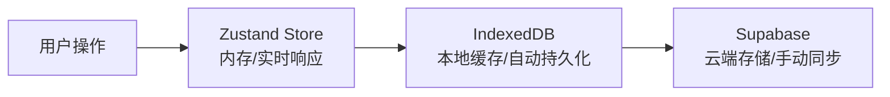
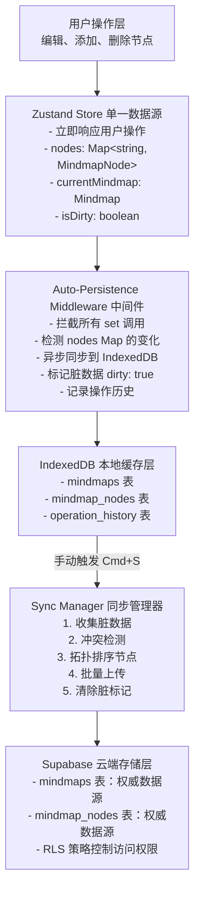
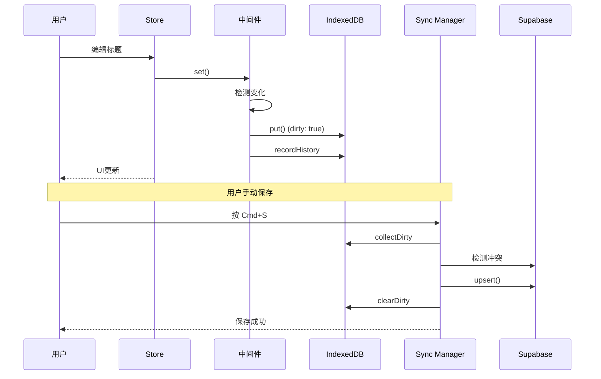

# 思维导图持久化系统设计文档

## 元信息

- 作者：Claude Code
- 创建日期：2025-10-18
- 最后更新：2025-10-18
- 相关文档：
  - [思维导图编辑器 Store 设计](./mindmap-editor-store-design.md)

## 关键概念

| 概念                         | 定义                                                                                    | 示例/说明                                                      |
| ---------------------------- | --------------------------------------------------------------------------------------- | -------------------------------------------------------------- |
| 脏数据 (Dirty Data)          | 在本地（IndexedDB）已修改但尚未同步到云端（Supabase）的数据                             | 用户编辑节点内容后，该节点被标记为 `dirty: true`               |
| 本地持久化                   | 将 Zustand Store 的状态自动同步到 IndexedDB 的过程                                      | 通过 Auto-Persistence 中间件实现                               |
| 云端同步                     | 将 IndexedDB 中的脏数据批量上传到 Supabase 的过程                                       | 用户按 Cmd+S 或点击保存按钮触发                                |
| 时间戳冲突检测               | 通过比较本地记录的服务器版本时间戳与当前服务器时间戳来检测是否有其他设备/用户修改了数据 | `server_updated_at` vs 实际服务器的 `updated_at`               |
| 操作历史 (Operation History) | 记录用户对思维导图的所有操作，存储在 IndexedDB 中用于操作审计（撤销/重做功能已移除）    | ADD_NODE、UPDATE_NODE_TITLE 等操作记录                         |
| 拓扑排序 (Topological Sort)  | 对节点按依赖关系（父子关系）排序，确保父节点总是在子节点之前处理                        | 上传节点到服务器时使用，避免 "Parent node does not exist" 错误 |

## 概述

思维导图持久化系统是一个三层数据流架构，负责将用户在思维导图编辑器中的所有操作持久化到本地 IndexedDB 和云端 Supabase，支持离线编辑、手动保存和冲突检测。系统由以下核心组件构成：

1. **Auto-Persistence 中间件**：自动拦截 Zustand Store 的状态变更，实时同步到 IndexedDB 并标记脏数据
2. **IndexedDB 数据层**：本地缓存思维导图和节点数据，支持脏数据标记和操作历史记录
3. **Sync Manager**：收集脏数据、执行冲突检测、批量上传到 Supabase、清除脏标记

## 背景和动机

### 问题

在思维导图编辑器的实现中，我们面临以下关键问题：

1. **性能要求**：用户编辑操作必须立即响应（< 50ms），不能等待网络请求
2. **离线支持**：用户可能在网络不稳定或离线的情况下编辑思维导图
3. **数据安全**：用户的编辑数据不能因浏览器崩溃或意外关闭而丢失
4. **多设备协作**：未来需要支持用户在多个设备间切换编辑，需要检测和解决冲突
5. **操作审计**：需要记录用户的所有操作，便于问题调试和未来可能的撤销/重做功能

### 现有方案的不足

- **仅使用内存 Store**：浏览器刷新或崩溃会丢失所有未保存的数据
- **每次操作都保存到服务器**：网络延迟导致用户体验卡顿，离线时无法编辑
- **使用 localStorage**：空间受限（通常 5-10MB），无法存储大型思维导图，且不支持索引查询

### 解决方案

采用**三层数据流架构**：



- **第一层（Zustand Store）**：提供实时响应，所有 UI 操作直接修改内存状态
- **第二层（IndexedDB）**：通过中间件自动同步，防止数据丢失，支持离线编辑
- **第三层（Supabase）**：手动触发同步，作为权威数据源，支持多设备访问

## 设计目标

### 功能目标

1. **自动本地持久化**：用户的所有编辑操作自动保存到 IndexedDB，无需手动触发
2. **离线编辑支持**：离线状态下可正常编辑，上线后可手动同步到云端
3. **冲突检测**：检测多设备/多用户同时编辑导致的冲突，提供解决选项
4. **操作历史记录**：记录所有操作，便于审计和未来功能扩展
5. **脏数据追踪**：明确标识哪些数据已修改但未同步到云端

### 性能目标

1. **编辑操作响应时间** < 50ms（内存更新）
2. **IndexedDB 同步时间** < 100ms（异步执行，不阻塞 UI）
3. **批量上传 100 个节点** < 1s（网络良好的情况下）
4. **冲突检测延迟** < 200ms（一次网络请求）

### 可靠性目标

1. **数据不丢失**：任何已执行的编辑操作都会持久化到 IndexedDB
2. **状态一致性**：Store、IndexedDB、Supabase 三层数据最终一致
3. **错误恢复**：同步失败时保留脏数据，允许用户重试

## 快速参考

### 主要文件和类

| 文件路径                                              | 核心类/函数             | 职责                                     |
| ----------------------------------------------------- | ----------------------- | ---------------------------------------- |
| `lib/db/schema.ts`                                    | `MindmapDB` 接口        | 定义 IndexedDB Schema                    |
| `lib/store/middleware/auto-persistence.middleware.ts` | `autoPersistence`       | Zustand 中间件，自动同步状态到 IndexedDB |
| `lib/sync/sync-manager.ts`                            | `SyncManager` 类        | 管理云端同步流程                         |
| `lib/store/mindmap-editor.store.ts`                   | `useMindmapEditorStore` | 思维导图编辑器 Store                     |

### 常用操作

```typescript
// 1. 添加节点（自动触发本地持久化）
const node = store.addChildNode({ parentId, position, title, content });

// 2. 检查是否有未同步的修改
const hasDirty = await syncManager.hasDirtyData(mindmapId);

// 3. 手动同步到云端
const result = await syncManager.syncMindmap(mindmapId);

// 4. 处理冲突（强制覆盖）
const result = await syncManager.syncMindmap(mindmapId, "force_overwrite");
```

## 设计方案

### 架构概览

#### 数据流图



#### 组件交互时序图

**场景：用户编辑节点标题**



### 数据模型

#### IndexedDB Schema

```typescript
interface MindmapDB extends DBSchema {
  // 思维导图元数据表
  mindmaps: {
    key: string; // short_id
    value: Mindmap & {
      // === Supabase 字段 ===
      id: string; // UUID 主键
      short_id: string; // 短 ID
      user_id: string; // 所有者用户 ID
      title: string; // 标题
      created_at: string; // 创建时间
      updated_at: string; // 更新时间

      // === 持久化扩展字段（仅 IndexedDB）===
      dirty: boolean; // 是否有未保存到云端的修改
      local_updated_at: string; // 本地最后修改时间
      server_updated_at: string; // 上次从服务器读取的 updated_at
    };
    indexes: {
      "by-user": string; // user_id
      "by-updated": string; // updated_at
    };
  };

  // 思维导图节点表
  mindmap_nodes: {
    key: string; // short_id
    value: MindmapNode & {
      // === Supabase 字段 ===
      id: string; // UUID 主键
      short_id: string; // 短 ID
      mindmap_id: string; // 所属思维导图的 UUID
      parent_id: string | null; // 父节点 UUID
      parent_short_id: string | null; // 父节点短 ID (优化查询)
      title: string; // 节点标题
      content: string | null; // 节点内容
      order_index: number; // 同级节点排序
      created_at: string; // 创建时间
      updated_at: string; // 更新时间

      // === 持久化扩展字段（仅 IndexedDB）===
      dirty: boolean; // 是否有未保存到云端的修改
      local_updated_at: string; // 本地最后修改时间
    };
    indexes: {
      "by-mindmap": string; // mindmap_id
      "by-parent": string; // parent_id
      "by-parent-short": string; // parent_short_id
      "by-updated": string; // updated_at
    };
  };

  // 操作历史表（用于操作审计，撤销/重做功能已移除）
  operation_history: {
    key: string; // operation_id
    value: {
      id: string; // 操作 ID
      mindmap_id: string; // 思维导图 UUID
      operation_type: OperationType; // 操作类型
      timestamp: string; // 操作时间

      // 操作前后状态
      before_state: NodeOperationState | null;
      after_state: NodeOperationState | null;

      // 撤销/重做状态（功能已移除，字段保留）
      is_undone: boolean;
    };
    indexes: {
      "by-mindmap": string; // mindmap_id
      "by-timestamp": string; // timestamp
    };
  };
}
```

#### 操作类型定义

```typescript
type OperationType =
  | "ADD_NODE" // 添加节点
  | "UPDATE_NODE_CONTENT" // 更新节点内容
  | "UPDATE_NODE_TITLE" // 更新节点标题
  | "DELETE_NODE" // 删除节点
  | "MOVE_NODE" // 移动节点（改变父节点）
  | "REORDER_NODE" // 重排序节点（改变 order_index）
  | "UPDATE_MINDMAP_TITLE"; // 更新思维导图标题

interface NodeOperationState {
  nodeId: string; // 节点的 short_id
  title?: string; // 标题（仅相关操作记录）
  content?: string; // 内容（仅相关操作记录）
  parent_id?: string | null; // 父节点 UUID（仅移动操作记录）
  order_index?: number; // 排序索引（仅移动/重排序记录）
}
```

#### 时间戳字段说明

| 字段名              | 位置                 | 语义                                  | 更新时机                 |
| ------------------- | -------------------- | ------------------------------------- | ------------------------ |
| `created_at`        | Supabase + IndexedDB | 数据创建时间（服务器时间）            | 创建时设置，永不修改     |
| `updated_at`        | Supabase + IndexedDB | 数据最后修改时间（服务器时间）        | 每次在服务器端修改时更新 |
| `local_updated_at`  | 仅 IndexedDB         | 本地最后修改时间（本地时间）          | 每次在本地修改时更新     |
| `server_updated_at` | 仅 IndexedDB         | 上次同步时从服务器读取的 `updated_at` | 加载、同步成功后更新     |

**`server_updated_at` 的作用**：

- 记录"本地最后一次知道的服务器版本"
- 用于检测服务器数据是否在本地修改后被其他设备/用户更新
- 冲突检测逻辑：`if (server.updated_at > local.server_updated_at) { /* 冲突 */ }`

### 核心逻辑

#### 1. 自动本地持久化（Auto-Persistence Middleware）

**工作原理**：

1. 包装 Zustand Store 的 `set()` 函数
2. 在每次状态更新前后捕获 `nodes` Map 的快照
3. 比较前后快照，检测节点变化（新增、更新、删除）
4. 异步同步变化到 IndexedDB，不阻塞 UI

**关键代码**：

```typescript
// lib/store/middleware/auto-persistence.middleware.ts:82-135

const wrappedSet = (partial, replace) => {
  // 1. 获取变更前的状态
  const prevNodes = new Map(get().nodes);

  // 2. 执行状态更新
  set(partial, replace);

  // 3. 获取变更后的状态
  const nextNodes = get().nodes;

  // 4. 检测节点变化
  const changes = detectNodeChanges(prevNodes, nextNodes);

  // 5. 异步同步到 IndexedDB
  if (changes.length > 0) {
    syncChangesToIndexedDB(changes, nextState, options);
  }
};
```

**检测节点变化**：

```typescript
// lib/store/middleware/auto-persistence.middleware.ts:140-168

function detectNodeChanges(
  prevNodes: Map<string, MindmapNode>,
  nextNodes: Map<string, MindmapNode>
): NodeChange[] {
  const changes: NodeChange[] = [];

  // 检测新增和更新
  for (const [nodeId, nextNode] of nextNodes.entries()) {
    const prevNode = prevNodes.get(nodeId);

    if (!prevNode) {
      // 新增节点
      changes.push({ type: "add", node: nextNode });
    } else if (hasNodeChanged(prevNode, nextNode)) {
      // 节点已更新
      changes.push({ type: "update", node: nextNode, prev: prevNode });
    }
  }

  // 检测删除
  for (const [nodeId, prevNode] of prevNodes.entries()) {
    if (!nextNodes.has(nodeId)) {
      changes.push({ type: "delete", node: prevNode });
    }
  }

  return changes;
}
```

#### 2. 脏数据追踪

**标记脏数据**：

当节点在本地发生任何变化时，中间件会标记 `dirty: true`：

```typescript
// lib/store/middleware/auto-persistence.middleware.ts:236-263

case 'add':
  await db.put('mindmap_nodes', {
    ...change.node,
    dirty: true,                        // 标记为脏
    local_updated_at: timestamp,        // 记录本地修改时间
  });
  break;

case 'update':
  await db.put('mindmap_nodes', {
    ...change.node,
    dirty: true,
    local_updated_at: timestamp,
  });
  break;
```

**收集脏数据**：

Sync Manager 在同步前收集所有 `dirty: true` 的数据：

```typescript
// lib/sync/sync-manager.ts:156-211

private async collectDirtyData(mindmapId: string) {
  const db = await getDB();

  // 获取思维导图
  const mindmap = await db.get('mindmaps', mindmapId);
  const dirtyMindmap = mindmap?.dirty ? mindmap : null;

  // 获取所有脏节点
  const index = db.transaction('mindmap_nodes').store.index('by-mindmap');
  const relevantNodes = await index.getAll(mindmap.id);
  const dirtyNodes = relevantNodes.filter(node => node.dirty);

  return { mindmap: dirtyMindmap, nodes: dirtyNodes };
}
```

#### 3. 冲突检测（基于时间戳）

**检测逻辑**：

```typescript
// lib/sync/sync-manager.ts:217-246

private async detectConflict(
  mindmap: Mindmap & { server_updated_at: string }
): Promise<{ serverUpdatedAt: string } | null> {
  // 1. 从服务器获取最新的 updated_at
  const { data } = await supabase
    .from('mindmaps')
    .select('updated_at')
    .eq('short_id', mindmap.short_id)
    .single();

  // 2. 比较时间戳
  const serverTime = new Date(data.updated_at).getTime();
  const localServerTime = new Date(mindmap.server_updated_at).getTime();

  // 3. 如果服务器时间 > 本地记录的服务器时间，说明有冲突
  if (serverTime > localServerTime) {
    return { serverUpdatedAt: data.updated_at };
  }

  return null; // 无冲突
}
```

**冲突解决策略**：

| 策略              | 行为                             | 使用场景                 |
| ----------------- | -------------------------------- | ------------------------ |
| `force_overwrite` | 用本地修改覆盖服务器数据         | 用户确定本地版本正确     |
| `discard_local`   | 丢弃本地修改，重新加载服务器数据 | 用户确定服务器版本正确   |
| `cancel`          | 取消保存操作                     | 用户需要先查看冲突再决定 |

#### 4. 拓扑排序节点

**问题**：

批量上传节点时，如果子节点在父节点之前插入，会触发 Supabase 的外键约束错误：

```
error: Parent node does not exist
```

**解决方案**：

在上传前对节点进行拓扑排序，确保父节点总是在子节点之前：

```typescript
// lib/sync/sync-manager.ts:252-303

private topologicalSortNodes<T extends { id: string; parent_id: string | null }>(
  nodes: T[]
): T[] {
  const nodeMap = new Map<string, T>();
  nodes.forEach(node => nodeMap.set(node.id, node));

  const sorted: T[] = [];
  const visited = new Set<string>();

  // 深度优先搜索
  const visit = (nodeId: string): void => {
    if (visited.has(nodeId)) return;

    const node = nodeMap.get(nodeId);
    if (!node) return;

    // 先访问父节点
    if (node.parent_id) {
      visit(node.parent_id);
    }

    visited.add(nodeId);
    sorted.push(node);
  };

  // 访问所有节点
  nodes.forEach(node => visit(node.id));

  return sorted;
}
```

#### 5. 批量上传到 Supabase

**上传流程**：

```typescript
// lib/sync/sync-manager.ts:308-400

private async uploadData(
  mindmap: Mindmap | null,
  nodes: MindmapNode[]
): Promise<SyncResult> {
  // 1. 上传思维导图元数据
  if (mindmap) {
    await supabase.from('mindmaps').upsert({
      id: mindmap.id,
      short_id: mindmap.short_id,
      user_id: mindmap.user_id,
      title: mindmap.title,
      created_at: mindmap.created_at,
      updated_at: new Date().toISOString(), // 使用当前时间
    });
  }

  // 2. 拓扑排序节点
  const sortedNodes = this.topologicalSortNodes(nodes);

  // 3. 批量上传节点（移除持久化扩展字段）
  const nodesToUpload = sortedNodes.map(node => ({
    id: node.id,
    short_id: node.short_id,
    mindmap_id: node.mindmap_id,
    parent_id: node.parent_id,
    parent_short_id: node.parent_short_id,
    title: node.title,
    content: node.content,
    order_index: node.order_index,
    created_at: node.created_at,
    updated_at: new Date().toISOString(),
  }));

  await supabase.from('mindmap_nodes').upsert(nodesToUpload);

  return { success: true, uploadedNodes: nodes.length };
}
```

**注意事项**：

- 使用 `upsert()` 而非 `insert()`，支持更新现有节点
- 移除 `dirty`、`local_updated_at` 等持久化扩展字段
- `updated_at` 使用当前时间而非本地记录的时间

#### 6. 清除脏标记

上传成功后，清除所有节点和思维导图的脏标记：

```typescript
// lib/sync/sync-manager.ts:405-451

private async clearDirtyFlags(mindmapId: string): Promise<void> {
  const db = await getDB();
  const currentTime = new Date().toISOString();

  // 1. 清除思维导图的脏标记
  const mindmap = await db.get('mindmaps', mindmapId);
  if (mindmap && mindmap.dirty) {
    await db.put('mindmaps', {
      ...mindmap,
      dirty: false,
      server_updated_at: currentTime, // ✅ 更新服务器时间戳
    });
  }

  // 2. 清除所有脏节点的标记
  const dirtyNodes = relevantNodes.filter(node => node.dirty);
  await Promise.all(
    dirtyNodes.map(node =>
      db.put('mindmap_nodes', {
        ...node,
        dirty: false,
      })
    )
  );
}
```

**关键点**：

- 更新 `server_updated_at` 为当前时间，记录本次同步的服务器版本
- 批量更新所有脏节点，而非逐个更新（性能优化）

## 实现要点

### 1. 中间件执行顺序

Zustand 中间件的执行顺序很重要，当前配置：

```typescript
// lib/store/mindmap-editor.store.ts:29-30

export const useMindmapEditorStore = create<MindmapEditorStore>()(
  autoPersistence({ enableHistory: true, debug: false })(
    immer((set, get) => ({
      // Store implementation
    }))
  )
);
```

**顺序**：`autoPersistence` → `immer`

- `autoPersistence` 在最外层，拦截所有 `set()` 调用
- `immer` 在内层，提供不可变更新的便利 API

### 2. Map 对象的变化检测

由于 Zustand 的 `set()` 函数是浅比较，直接修改 Map 对象不会触发状态更新。因此需要使用 Immer 来创建新的 Map：

```typescript
// ❌ 错误：直接修改 Map，不会触发中间件
set((state) => {
  state.nodes.set(nodeId, newNode); // 引用相同，中间件检测不到变化
});

// ✅ 正确：Immer 会创建新的 Map
set((state) => {
  state.nodes.set(nodeId, newNode); // Immer 自动生成新 Map
});
```

### 3. 异步持久化不阻塞 UI

中间件的 `syncChangesToIndexedDB` 是异步执行的，使用 `.catch()` 捕获错误而不是 `await`：

```typescript
// lib/store/middleware/auto-persistence.middleware.ts:126-130

if (changes.length > 0) {
  syncChangesToIndexedDB(changes, nextState, options).catch((error) => {
    console.error("[AutoPersistence] Failed to sync:", error);
  });
}
```

这样做的好处：

- UI 更新立即完成，不等待 IndexedDB 写入
- 即使 IndexedDB 写入失败，UI 仍然正常工作
- 用户编辑体验流畅（< 50ms 响应）

### 4. 操作历史记录的优化

虽然撤销/重做功能已移除，但操作历史仍然被记录用于审计。为避免无限增长，需要定期清理：

```typescript
// lib/store/middleware/persistence.middleware.ts:327-350

export async function cleanupHistory(
  mindmapId: string,
  maxSize: number = 1000
): Promise<void> {
  const db = await getDB();
  const allHistory = await db
    .transaction("operation_history")
    .store.index("by-mindmap")
    .getAll(mindmapId);

  // 按时间排序，保留最新的 1000 条
  allHistory.sort(
    (a, b) => new Date(b.timestamp).getTime() - new Date(a.timestamp).getTime()
  );

  if (allHistory.length > maxSize) {
    const toDelete = allHistory.slice(maxSize);
    await Promise.all(
      toDelete.map((op) => db.delete("operation_history", op.id))
    );
  }
}
```

**建议调用时机**：

- 每次同步成功后调用
- 或在应用启动时检查并清理

### 5. IndexedDB 的版本管理

当前版本号：`DB_VERSION = 2`

版本升级策略：**简化迁移，清空数据**

```typescript
// lib/db/schema.ts:115-133

upgrade(db, oldVersion, newVersion) {
  if (oldVersion > 0 && newVersion && oldVersion < newVersion) {
    console.warn('Database schema changed. Clearing all data.');

    // 删除所有已存在的 object stores
    const storeNames = Array.from(db.objectStoreNames);
    storeNames.forEach(storeName => {
      db.deleteObjectStore(storeName);
    });
  }

  // 重新创建所有表
  if (!db.objectStoreNames.contains('mindmaps')) {
    // ... 创建表
  }
}
```

**注意**：

- 这种策略适用于开发阶段，生产环境应实现数据迁移
- 清空数据前应检查是否有脏数据，提示用户先同步到云端

## 设计决策

### 1. 为什么选择三层架构？

**备选方案**：

- A. 直接保存到 Supabase（每次操作都网络请求）
- B. 只使用 localStorage（空间受限，无法存储大型思维导图）
- C. 只使用 IndexedDB，定期自动同步到 Supabase
- D. ✅ **三层架构：Store + IndexedDB + Supabase**

**决策理由**：

- **性能**：Store 提供实时响应，IndexedDB 异步持久化不阻塞 UI
- **离线支持**：IndexedDB 支持完整的离线编辑
- **数据安全**：三层备份，浏览器崩溃也不会丢失数据
- **灵活性**：手动同步给用户更多控制权，避免网络抖动导致的频繁请求

### 2. 为什么不实现自动同步到云端？

**问题**：

- 网络抖动导致频繁请求，浪费带宽
- 自动同步可能在用户编辑过程中触发，导致冲突
- 用户可能不希望每次小修改都立即同步

**当前方案**：手动触发（Cmd+S 或保存按钮）

**未来扩展**：

- Phase 2 可以添加"自动保存"选项（每 30 秒检查一次）
- 实时协作模式下可以启用自动同步

### 3. 为什么使用拓扑排序而不是递归插入？

**备选方案**：

- A. 递归插入（先插入根节点，再插入子节点）
- B. ✅ **拓扑排序后批量插入**

**决策理由**：

- **性能**：批量插入（一次网络请求）比递归插入（多次请求）快
- **简单**：不需要处理插入顺序和依赖关系
- **可靠**：即使节点顺序混乱，拓扑排序也能保证正确性

### 4. 为什么记录操作历史但移除撤销/重做功能？

**背景**：

- 撤销/重做功能的实现复杂度高，需要考虑大量边界情况
- 当前优先级是实现基础的持久化和同步功能

**决策**：

- **保留 `operation_history` 表结构**：为未来的撤销/重做功能预留接口
- **继续记录操作历史**：用于操作审计和问题调试
- **移除撤销/重做 UI 和逻辑**：减少当前实现复杂度

**未来扩展**：

- Phase 2 可以基于现有的操作历史重新实现撤销/重做功能

### 5. 为什么冲突检测使用时间戳而不是版本号？

**备选方案**：

- A. 使用版本号（每次修改 version++）
- B. ✅ **使用时间戳（`updated_at` 字段）**
- C. 使用 Operational Transformation（OT）或 CRDT

**决策理由**：

- **简单**：Supabase 默认提供 `updated_at` 字段，无需额外字段
- **直观**：时间戳易于理解和调试
- **足够**：第一版不支持实时协作，时间戳检测足够
- **扩展性**：未来实时协作时可以升级到 OT 或 CRDT

### 6. 为什么不实现重试机制？

**问题**：

- 网络请求失败时，是否自动重试？

**决策**：**不实现自动重试**

**理由**：

- **简单**：保持系统简单，避免增加复杂度
- **问题重现**：自动重试会隐藏问题，导致调试困难
- **用户控制**：手动重试让用户有更多控制权
- **后续扩展**：有明确需求时再添加

**当前方案**：

- 显示保存失败提示
- 提供"重试"按钮让用户手动重试

## 性能优化

### 已实现的优化

1. **异步持久化**：IndexedDB 写入异步执行，不阻塞 UI
2. **批量上传**：收集所有脏数据一次性上传，减少网络请求
3. **索引优化**：在 `by-mindmap`、`by-parent-short` 等字段上创建索引
4. **拓扑排序缓存**：排序后的节点列表可以复用

### 未来可优化的点

1. **增量同步**：只上传自上次同步以来修改的节点
2. **压缩传输**：对大型思维导图进行压缩后传输
3. **分批上传**：超过 100 个节点时分批上传
4. **WebWorker**：将 IndexedDB 操作移到 WebWorker 中执行

## 测试策略

### 单元测试

- ✅ `detectNodeChanges()` 函数测试（新增、更新、删除）
- ✅ `topologicalSortNodes()` 函数测试（循环引用检测）
- ✅ `determineOperationType()` 函数测试
- ⏳ `SyncManager.collectDirtyData()` 测试
- ⏳ `SyncManager.detectConflict()` 测试

### 集成测试

- ⏳ 完整的编辑 → 本地持久化 → 云端同步流程
- ⏳ 离线编辑 → 上线后同步流程
- ⏳ 冲突检测和解决流程

### E2E 测试

- ⏳ 用户编辑节点并保存
- ⏳ 模拟网络断开和恢复
- ⏳ 多标签页同时编辑（浏览器 BroadcastChannel）

## 未来扩展

### Phase 2: 实时协作

基于 Supabase Realtime 的多人实时协作：

```typescript
// 订阅思维导图的实时更新
supabase
  .channel(`mindmap:${mindmapId}`)
  .on(
    "postgres_changes",
    {
      event: "*",
      schema: "public",
      table: "mindmap_nodes",
      filter: `mindmap_id=eq.${mindmapId}`,
    },
    (payload) => {
      // 收到其他用户的修改
      handleRemoteChange(payload);
    }
  )
  .subscribe();
```

### Phase 3: 差异对比视图

冲突检测时显示本地和云端的差异：

```tsx
<ConflictDialog>
  <DiffView local={localData} server={serverData} />
  <Button onClick={forceOverwrite}>强制覆盖</Button>
  <Button onClick={discardLocal}>丢弃本地修改</Button>
</ConflictDialog>
```

### Phase 4: 撤销/重做功能

基于现有的 `operation_history` 表实现：

```typescript
async function undo() {
  // 1. 获取最后一个操作
  const lastOp = await getLastOperation();

  // 2. 执行反向操作
  await executeReverseOperation(lastOp);

  // 3. 标记为已撤销
  await markAsUndone(lastOp.id);
}
```

## 参考资料

### 相关设计文档

- [思维导图编辑器 Store 设计](./mindmap-editor-store-design.md)
- [IndexedDB 持久化中间件设计](./indexeddb-persistence-middleware-design.md)
- [ID 设计规范](./id-design.md)

### 外部资源

- [Zustand 中间件文档](https://github.com/pmndrs/zustand#middleware)
- [IndexedDB API 文档](https://developer.mozilla.org/en-US/docs/Web/API/IndexedDB_API)
- [Supabase Realtime 文档](https://supabase.com/docs/guides/realtime)
- [Immer 文档](https://immerjs.github.io/immer/)

## 修订历史

| 日期       | 版本 | 修改内容                       | 作者        |
| ---------- | ---- | ------------------------------ | ----------- |
| 2025-10-18 | 1.0  | 初始版本，基于当前代码实现梳理 | Claude Code |
